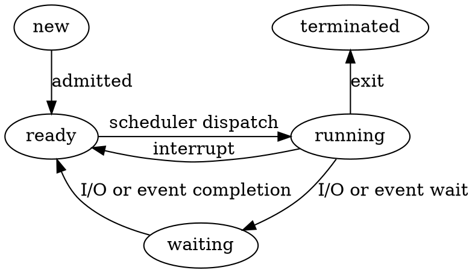
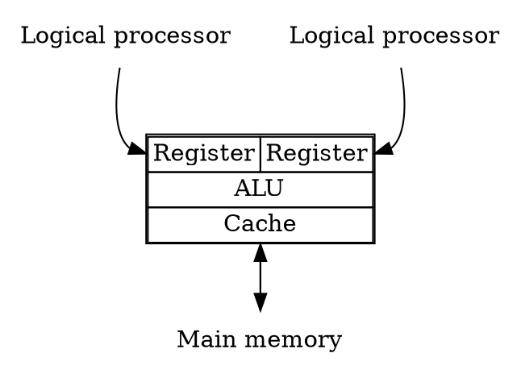
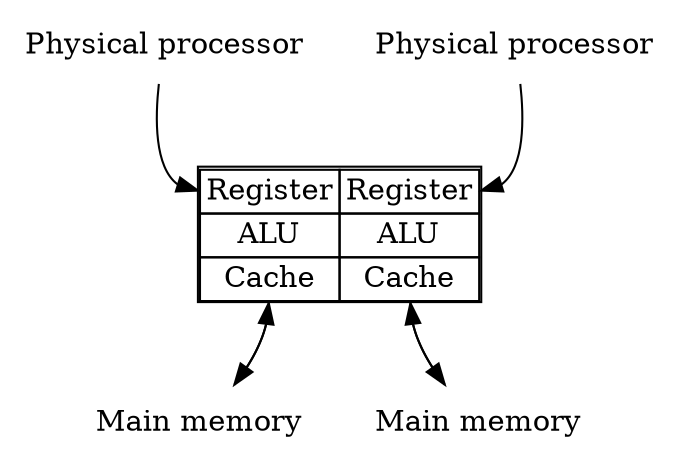
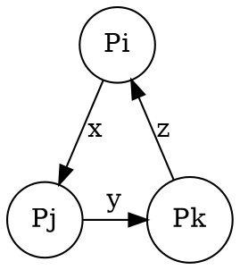
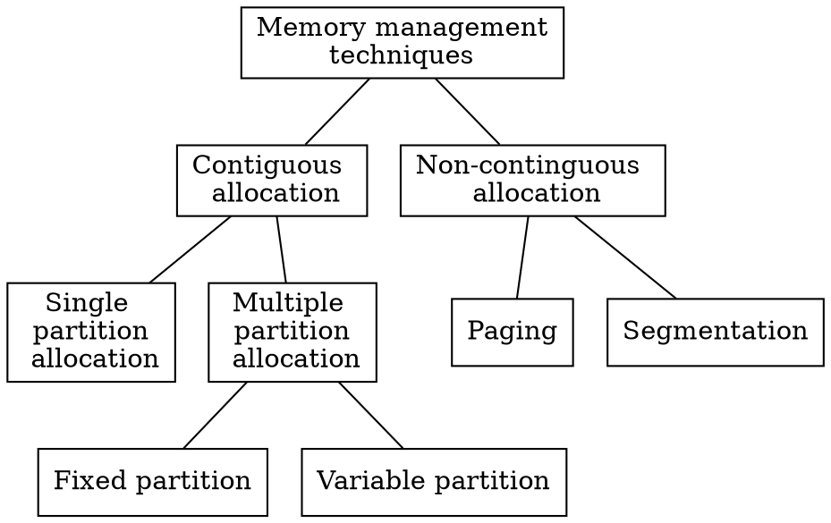

# 操作系统复习
## Introduction 1
### 什么是操作系统
* 在用户和计算机硬件之间的中介
* OS是个软件
——一个虚拟化计算机的程序


OS的作用：
* 物理机层面（CPU Memory Devices）：分配资源
* 虚拟机层面（Application）：控制程序

### History of OSs
No OS->Simple Batch Systems->Batch System->Multiprogramming systems->Time sharing system->Modern System

### 系统类型
#### 分布式系统 Distributed System
优点：**loosely-coupled 松耦合**
- 资源共享
- 提高计算速度
- 更可靠
- 交互性强

#### 并行系统 Parallel Operating System
多处理器 **紧耦合**
- 所有处理器共享时钟、总线、内存

两类
- 对称并行 Symmetric multiprocessing
    * 每个CPU没有差别
- 非对称并行 Asymmetric multiprocessing
    * 每个CPU有特定功能

优点
- 提高吞吐量
- 提高可靠性
- 规模经济

#### 集群系统 Clustered Systems
- 和并行系统不同
    * 由多个独立系统组成
- 和分布式系统不同
    * 共享存储

#### 实时系统 Real time System
硬实时：保证所有任务都在deadline之前完成
软实时：尽最大努力
#### 无处不在的系统 Ubiquitous Systems
未来
更关注人机交互
安全

## Introduction 2
### 计算机系统四大组成
User：使用系统的角色，不一定是人
Application programs
Operating system
Hardware

### 启动过程 Startup process
1. 打开电源
2. CPU通过系统时钟初始化
3. 在BIOS中找到启动程序的CPU的第一条指令
4. 执行开机自检(POST)，检查所有硬件设备

**Bootstrap program** 启动程序
很重要，在开机或重启的时候加载
-一般写在ROM或EPROM中，称为**固件 firmware**

### 运行过程 Running process
OS等待人去交互

多个任务如何共享一个CPU？
- **中断 interrupt**

### I/O操作
* IO设备可以和CPU同时执行
    - I/O在设备和控制器缓存（controller's buffer）之间转移数据
    - CPU在控制器和主存之间转移数据
* I/O设备访问
    - Memory Mapped I/O（CPU就像访问内存一样访问I/O）
    - Programmed I/O（每个控制寄存器都分配一个I/O端口号，CPU使用特定的I/O指令去读写寄存器）

### 轮询和中断 Polling or Interrupt
#### 轮询
CPU不断读状态寄存器直到有任务
-效率不高
#### 中断
谁有需要谁就主动通知CPU
-硬件触发通过**总线** 软件触发通过**系统调用**

**大部分OS都是中断的**

### 操作系统的服务
* 程序执行 Program execution
* I/O操作 I/O operations
* 文件系统的操作 File-system manipulation
* Communications 在进程间传递消息
* 错误检测 Error detection

额外的功能
* 资源分配 Resource allocation
* 账号管理 Accounting 
* 保护 Protection

### 所有操作系统共同的系统组件
* **Process Management**
* **Main Memory Management**
* **File Management**
* **I/O System Management**
* **Secondary Management**
* Networking
* Protection System
* Command-Interpreter System

### Process management 进程管理
一个进程是一个正在执行的程序

进程管理负责
- 进程的管理和删除
- 进程的暂停和恢复
- 提供机制为
    * 进程同步
    * 进程交流

### Main Memory Management 主存管理
主存管理负责
- 追踪哪部分内存正在被使用，被谁使用
- 决定当内存空间可用时哪个进程被加载
- 在需要时分配和收回内存空间

### File management 文件管理
一个文件是由它的创建者定义的一系列相关信息的集合

文件管理负责
- 文件的创建和删除
- 文件夹的创建和删除
- 支持基本的管理文件和文件夹
- 映射文件到辅助存储器
- 备份文件到稳定的存储介质

### I/O system management I/O系统管理
I/O系统包含
- 缓存系统
- 通用设备驱动接口
- 特定硬件设备的驱动

### Secondary-storage management 辅存管理
大部分计算机系统使用磁盘

磁盘管理负责
- 空闲空间管理
- 存储分配
- 磁盘调度

## Process & thread 1
### 什么是进程 Process
**Process——a program in execution** 一个执行过程中的程序
* Program（executable）：磁盘上的passive实体
* Process：active entity被激活的实体，包含
    * 程序计数器
    * 栈
    * 堆
    * 文本
    * 数据
#### 什么是程序 Program
一个程序包含
- Code
- Data
- DLLs 动态链接库
- mapped files

Running a program 运行一个程序
* OS创建一个进程，并为它分配内存

Process vs Program
* 两个进程可能和同一个程序相关联
- 两条单独执行的顺序
- 文本部分相同，数据、堆、栈都不同

### Process states 进程状态
一个进程执行时，它会改变状态

**基本状态**
- running：指令正在执行
- waiting：进程等待某个事件发生
- ready：进程等待分配给CPU

**扩展状态**
- new：进程被创建
- terminated：进程结束执行

dot语言画进程状态图如下



*为什么waiting之后不能直接running？*  
如果有两条队列都能进入running状态，调度很麻烦。同时只有一条队列进入running队列也对所有进程公平。

### Process creation 进程创建
四种典型事件
- 系统初始化
- 用户请求创建
- 系统调用相应接口
    * Unix:fork()
    * Windows:CreateProcess()
- 开启一个批处理任务

### Process hierarchies 进程层次
父进程可以创建子进程，子进程可以继续创建子进程，形成进程树

### Process relationships 进程关系
#### Resource sharing
- 父子进程共享全部资源
- 子进程分享父进程资源的子集
- 父子进程不共享资源
#### Execution
- 父子进程同时执行
- 父进程等子进程结束再执行
#### Address space
- 子进程复制了父进程的地址空间
- 子进程有专门的程序加载地址空间
#### Independent or cooperating

### Process termination 进程结束
- 正常退出（自愿）
- Error exit（自愿）
- Fatal error（强制） 致命错误
- 被其他进程杀死

**Exit 正常退出**
**Abort放弃**


## Process and threads 2
### Data structure of a process
#### Process control block(PCB)进程控制块
和每个进程相关联的信息，包含：
- Process state 进程状态
- Program counter 程序计数器
- CPU register 寄存器：为了能让CPU离开进程后回来还能执行
- CPU scheduling information CPU调度信息
- Memory-management information 内存管理信息
- ~~Account information~~（本课程不学习）
- ~~I/O status information~~（本课程不学习）

### Organization model 进程组织模型
进程被组织成不同的队列
- Ready一条 **<font color=darkblue>Ready queue</font>**
- New一条 **<font color=darkblue>Job queue</font>**
- Waiting一条或多条 不同的设备可以放到不同的队列 **<font color=darkblue>Device queues</font>**

### Process scheduling 进程调度
进程被需要触发的事件驱动，从一条队列转移到另一条队列

#### 调度类型
* **<font color=red>Long-term scheduling(or job scheduling)</font> 长程调度**
    **<font color=darkblue>从job queue中选一个到ready queue中</font>**
    内存可用时,从磁盘中移出一个到内存
    不太频繁，速度慢
* **<font color=red>Short-term scheduling(or CPU scheduling)</font> 短程调度**
    **<font color=darkblue>从ready queue中选一个到running</font>**
    更加频繁，速度必须快
* **<font color=red>Interrupt handling</font> 中断处理**
    **<font color=darkblue>从waiting到ready</font>**
* **<font color=red>Medium-term scheduling</font>**
    CPU和内存资源管理的混合
    **<font color=darkblue>swapping</font>**：一个进程需要长期等待时，把它先移动到磁盘，把其他进程移入内存

### Scheduling actions
当CPU从一个进程切换到另一个进程时，系统要保存旧进程的状态，加载新进程的状态。这个过程叫 **<font color=red>上下文切换 context switch</font>**

### 线程 Threads
在进程之间切换越快越好，而创建进程和进程通信工作量很大，所以产生了线程
线程有
* 独立的 <font color=darkblue>PC, Register, Stack pointer</font>
* 共享的 <font color=darkblue>Code, Data, File</font>

进程是资源的拥有者
线程用来调度任务


#### 超线程和多核
##### 超线程


##### 多核


#### 两类线程
- 用户线程
    用户层级
    所有线程在user space中完成
- 内核线程
    OS直接执行

## Process Synchronization 1
* IPC(Interprocess communication)
    协作的进程需要IPC

### 三种IPC模型
进程通信可以通过
- **shared memory** 共享内存
- **pipe** 管道
- **message passing** 消息传递

### Message passing
- 建立一个communicate link(physical/logical)
- 通过send/receive交换

#### 直接通信，对称寻址 Direct communication-symmetric addressing
* 进程必须互相知道对方名字
    - send(P,message)
    - receive(Q,message)
* 自动建立了link **两个进程间只有一条，一条链路只有两个进程**

#### 直接通信，非对称寻址
* 发送时指明了名字，接收只有id
    - send(P,message)
    - receive(id,message)
例如：共享打印机

直接通信的缺点：必须知道对方的名字，局限了模块化

#### 间接通信
* 消息从中介取，往中介发 mailbox or ports
    - send(A,message)
    - receive(A,message)

每个mailbox都有独立id  
**一条链路连接多个进程**

### IPC synchronization
- **<font color=red>Blocking send </font>**：直到上一个消息被接收时才会发下一个消息
- **<font color=red>Non-blocking send </font>**：随时发
- **<font color=red>Blocking receive </font>**：一个消息来的时候receiver才工作
- **<font color=red>Non-blocking receive </font>**：随时取

Non-blocking和blocking receive是最常见的

### IPC buffering
link的消息队列容量
- Zero capacity 队列长度=0
- Bounded capacity 队列长度=n
- Unbounded capacity 队列长度=$\infty$

### Critical-Section Problem 临界区问题
对于共享数据的并行访问可能导致数据的不一致
#### <font color=darkblue>Race condition</font> 竞争条件
多个进程同时访问操作文件，最终结果取决于最后执行的指令  
为了避免竞争条件，并行的进程必须是 <font color=red>mutual exclusion </font> **互斥的**

**互斥**
- 如果一个进程正在使用一个共享文件或变量，其他进程不能做同样的事

#### <font color=darkblue>The critical-section problem</font>
每个进程拥有的操作共享数据的代码称为 <font color=red>critical section </font> **临界区**。要保证当一个进程执行时它的临界区代码时，其他进程不能执行临界区代码

解决方案：
**<font color=darkblue>在执行之前加点条件，判断能否执行，执行完毕后解锁</font>**

```c
do{
    entry section   //执行前判断
        crical section
    exit section    //执行完毕后解锁
        reminder section
}
```

解决临界区问题需要满足
- **<font color=darkblue>Mutual Exclusion </font> 互斥**
- **<font color=darkblue>Progress </font> 前进原则**
    如果没有临界区代码在执行，有一个进程想进入临界区是，应当允许
- **<font color=darkblue>Bounded wait </font> 有限等待** 
    想进入临界区的在有限时间内总能进入

#### 例 火车问题
##### 前提
有两列相向而行的火车需要在某个地点占用同一段铁轨，如何保证两车进入不会相撞，且两车都能正常运行

##### 算法1 交替进入
```c
int turn;
turn=i  //Pi可以进入
```
Pi
```c
do {
    while(turn!=i);
    /* critical section */
    turn=j;
    /* remainder section */
} while(1);
```
**满足互斥，但不满足前进原则（只有一辆车运行的情况下）**

##### 算法2 flag each process 给每个进程都标记
```c
boolean flag[2];
flag[i]=true;
```
Pi
```c
do {
    flag[i]=true;
    while(flag[j]); //空循环等待j
    /* critical sectioon */
    flag[i]=false;
    /* remainder */
} while(1);
```
**如果两个同时刻到，那么都进不去，不满足Bounded waiting**

##### 算法3 1和2的组合
```c
do {
    flag[i]=true;
    turn=j; //先把机会让给另外一个
    while(flag[j] && turn==j);  //如果另外一个也到了，就空循环等待
    /* critical section */
    flag[i]=false;
    /* remainder section */
} while(1);
```
**三个要求都满足**

## Process Synchronization 2
### Synchronization tools for IPC
* Synchronization hardware
* Semaphores
* Critical Regions
* Monitors

### Synchronization hardware 硬件同步
很多系统提供了硬件对于临界区代码的支持
- 单处理器可以禁止中断，使当前运行代码不会被抢占
- 在多处理器上上述方案效率太低

现代计算机提供了特别的 **<font color=darkblue>原子的(atomic) </font>** 硬件指令
- 检查和修改字的内容
- 或交换两个字的内容

#### TestAndSet Instruction 检查和修改指令 <font color=darkblue>自旋锁 </font>
方法：
```cpp
boolean TestAndSet(boolean *target) {
    boolean rv=*target;
    *target=true;
    return rv;
}
```
初始化：
```cpp
boolean lock=false;
```
执行时：
```cpp
do{
    while(TestAndSet(&lock));
    //critical section
    lock=false;
    //remainder section
}
```

#### Swap Instruction
操作两个数据，与指令TestAndSet一样原子执行
```cpp
void Swap(boolean *a,boolean *b) {
    boolean temp=*a;
    *a=*b;
    *b=temp;
}
```
初始化：
```cpp
boolean lock=false;
```
执行时：
```cpp
do {
    key=true;
    while(key==true)
        Swap(&lock, &key);
    //critical section
    lock=false;
    //remainder
} 
```
### Semaphores 信号量
Dijkstra提出
**信号量 一个整形变量，只能通过两个标准原子操作：**
* <font color=red>wait()</font>
* <font color=red>signal()</font>

wait(s):
```c
while(s<=0)
;   //no-operation
s--;
```

signal(s):
```c
s++
```

在wait()和signal()操作中，对信号量的修改必须是原子的，即当一个进程修改信号量值时，不能有其他进程同时修改同一信号的值

初始化：
```c
int matex=1;
```
Critical section of n processes
```c
do {
    wait(mutex);
    //critical section
    signal(mutex);
    //remainder section
} while(1);
```

#### 两种类型的信号量
* **计数信号量**的值域不受限制，用来表示可用资源的数量
* **二进制信号量**的值只能为0或1

#### 信号量实现的分析
主要缺点是 **<font color=darkblue>忙等待(busy waiting) </font>**
##### 忙等待
当一个进程位于其临界区内时，其他想进入临界区的进程必须连续循环等待，浪费了CPU时钟。也称为自旋锁。  
##### 解决方法
为了克服忙等待，可以使用阻塞并放入等待队列的操作。通过wakeup()来重新执行

定义一个新结构
```c
typedef struct {
    int value;
    struct process *List;
} semaphore;
```
- Block operation: <font color=red>block() </font>
- Wakeup operation: <font color=red>wakeup() </font>

新的信号量操作定义
```c
wait(semaphore *S){
    S.value--;
    if(S.value<0) {
        block();    //add this process to S.List
    }
}

signal(semaphore *S) {
    S.value++;
    if(S.value<=0) {
        wakeup(P);  //remove a process P from S.List
    }
}
```
Bounded-Buffer Problem 可用计数信号量来解决

#### Deadlock and Starvation 死锁与饥饿
* Deadlock: 两个或多个进程无限地等待一个事件
* Starvation: 无限期阻塞

### Critical Regions 临界域
一种高层同步结构

### Monitor 管程
另一种高层同步结构

比信号量更高的抽象。或者说并没有这种实体存在于系统或编程语言中,更多的是一种机制，一种解决方法，但是编程语言和操作系统都提供了实现管程的重要部件**条件变量**

管程就是管理一组共享变量的程序。主要有一下几部分组成
```c
mutex // 一个互斥锁，任何线程访问都必须先获得mutex

condition //一个或者多个，每个条件变量都包含一个等待队列

balabala //共享变量及其访问方法
```
#### 特点

* 采用面向对象方法，简化线程同步
* 同一时刻仅有一个线程在管程中工作
* 可临时放弃管程的访问权，叫醒一个在等待队列中的线程，这是其他方法都没有的(原子锁和信号量一旦进入临界区就必须执行完临界区代码才能退出)，而实现这一点采用的就是**条件变量**

#### 类型
* Hansan管程
* Hoare管程

#### 实现
管程类型提供了一组由程序员定义的、在管程内互斥的操作
```c
monitor monitor-name {
    shared variable declarations
    procedure body P1() {   }
    procedure body Pn() {   }
    {initialization code}
}
```
同一时刻管程内只有一个进程在活动，因此不需显式地编写同步代码

#### 条件变量
为了让进程在管程内等待，必须声明一些condition类型的变量，即条件变量

条件变量两种操作
- x.wait() 进程挂起
- x.signal() 被挂起的进程重新活动


##### 注意
这里的wait和P操作是不一样的，最大的不同就是他一定会将自己阻塞同时释放锁。而signal如果没有等待线程相当于一个空操作。而且numWaiting 不可能为负数

## Process Synchronization 3
**一些经典的同步问题**

### 1. 读写者问题
#### 前提条件
1. 写者、读者互斥访问文件资源。
2. 多个读者可以同时访问文件资源。
3. 只允许一个写者访问文件资源。

#### 两种情况
##### 1. 读者优先
* 没有读者会因为有一个写者在等待而去等待其他读者的完成
* 写者执行写操作前，应该让所有读者和写者退出
* 除非有一个写者在访问临界区，其他情况下，读者不应该等待

##### 2. 写者优先
如果一个写者等待访问对象，那么不会有新读者开始读操作

#### 读者优先的实现
初始化变量
```c
BINARY_SEMAPHORE wrt=1;
BINARY_SEMAPHORE mutex=1;
int readcount=0;
```

Reader:
```c
do {
    wait(mutex);    //Allow 1 reader in entry
    readcount=readcount+1;
    if(readcount==1)
        wait(wrt);  //1st reader locks writer
    signal(mutex);
        //reading operation
    wait(mutex);
    readcount=readcount-1;
    if(readcount==0)
        signal(wrt);    //last reader frees writer
    signal(mutex);
}
```

Writer:
```c
do {
    wait(wrt);
        //writing operation
    signal(wrt);
}
```

#### 写者优先的实现
初始化变量
```c
BINARY_SEMAPHORE read=1;    //使有写者进行操作时读者等待
BINARY_SEMAPHORE file=1;    //使文件操作互斥
BINARY_SEMAPHORE mutex1=1;  //使改变readcount的方法互斥
BINARY_SEMAPHORE mutex2=1;  //使改变writecount的方法互斥
int readcount=0;
int writecount=0;
```

Reader:
```c
do {
    wait(read); //等待直至读者队列没有阻塞，即全部写者都退出，同时自身进入后再次上锁，使后来的读者等待，因为接下来要进行一系列互斥的操作
    wait(mutex1);
    readcount++;
    if(readcount==1)    //第一个读者进入
        wait(file);     //后来的写者无法操作文件，但对后来的读者的文件操作不造成影响
    signal(mutex1);
    signal(read);   //释放
        //read operation
    wait(mutex1);
    readcount--;
    if(readcount==0)
        signal(file);
    signal(mutex1);
}
```

Writer:
```c
do {
    wait(mutex2);
    writecount++;
    if(writecount==1)   //第一个写者进入
        wait(read); //阻塞读者队列
    signal(mutex2);
    wait(file);
        //write operation
    signal(file);
    wait(mutex2);
    writecount--;
    if(writecount==0)   //最后一个写者退出
        signal(read);   //释放读者队列
    signal(mutex2);
}
```

### 哲学家进餐问题
#### 前提条件
5个哲学家围着桌子吃饭，筷子只有5枝，分别在每个哲学家的左手边和右手边。哲学家必须得到两只筷子才能吃饭，要使每个哲学家都能吃到饭，该如何调度

#### 解决方法
只有左右两只筷子都可用时，才允许一个哲学家拿起它们

#### 管程实现
```java
void philosopher(int i) {   //主方法
    while(true) {
        thinking();
        dp.pickup(i);
        eating();
        dp.putdown(i);
    }
}

monitor dp {
    enum{thinking,hungry,eating} state[5];
    condition self[5];
    void pickup(int i) {
        state[i]=hungry;    //设置本人为饥饿状态
        test[i];    //测试左右两个人是否在吃
        if(state[i]!=eating)    //如果需要等待
            self[i].wait();     //进入等待，在pickup方法处阻塞
    }
    void putdown(int i) {
        state[i]=thinking;
        test((i+4)%5);      
        test((i+1)%5);  //本人放下筷子后，状态发生了变化，测试左右两个是否等待吃，如有，则给他们开始吃的机会（但也不一定能马上开始吃）
    }
    void test(int i) {
        if((state[(i+4)%5]!=eating) && (state[i]==hungry) && (state[(i+1)%5]!=eating)) {    //如果左右两个人并没有在吃，而且自己处于饥饿状态
            state[i]=eating;    //设置状态为eating
            self[i].signal();   //释放pickup方法，在philosopher方法中下一步将执行eating操作
        }
    }
    initializationCode() {
        for(int i=0;i<5;i++)
            state[i]=thinking;
    }
}
```

### 生产者消费者问题
#### 前提条件
一个生产者，一个消费者，库存有限，如何能持续生产
#### 解决思路
对于生产者，如果缓存是满的就去睡觉。消费者从缓存中取走数据后就叫醒生产者，让它再次将缓存填满。若消费者发现缓存是空的，就去睡觉了。下一轮中生产者将数据写入后就叫醒消费者。

不完善的解决方案会造成“死锁”，即两个进程都在“睡觉”等着对方来“唤醒”。
#### 伪代码
初始化变量：
```c
semaphore mutex=1; //临界区互斥信号量
semaphore empty=n;  //空闲库存空间
semaphore full=0;  //库存初始化为空
```

生产者进程：
```c
producer ()
{
    while(1)
    {
        produce an item in nextp;  //生产数据
        P(empty);  //获取空闲库存单元
        P(mutex);  //进入临界区.
        add nextp to buffer;  //将数据放入缓冲区
        V(mutex);  //离开临界区,释放互斥信号量
        V(full);  //库存数加1
    }
}
```

消费者进程：
```c
consumer ()
{
    while(1)
    {
        P(full);  //获取库存数单元
        P(mutex);  // 进入临界区
        remove an item from buffer;  //从库存中取出数据
        V (mutex);  //离开临界区，释放互斥信号量
        V (empty) ;  //空闲库存数加1
        consume the item;  //消费数据
    }
}
```

## CPU Scheduling 1


### CPU调度解决的问题
何时调度

### 类型
* 非抢占式 nonpreemptive
    1. 从running到waiting
    2. Terminates
* 抢占式
    1. 从waiting到ready
    2. 从running到ready

### 如何调度
1. 切换上下文
2. 转换为use mode
3. 跳转到用户程序中的适当位置来重启程序

### Scheduling criteria 性能指标
* Max CPU utilization —— 让CPU越忙越好
* Max Throughput 单位时间内能完成的进程个数越多越好
* Min Turnround time 周转时间越短越好
* Min Waiting time 等待时间
* Min Response time 响应时间指从请求提交到第一个相应产生，并非输出产生

不同种类OS有不同的目标

### 重点讨论
批处理系统的调度算法

主要有4种
* First-Come, First-Served <font color=darkblue>(FCFS) </font>
* Shortest Job First <font color=darkblue>(SJF) </font>
* Shortest Remaining Time First <font color=darkblue>(SRTF)</font>
* Three-Level Scheduling

主要的时间概念
* 周转周期=结束时间-到达时间
* 带权周转时间=周转时间/服务时间

例子

### FCFS
FCFS最简单，是非抢占式的

进程按照请求CPU的顺序排序

上述例子解决图


表格

### SJF
如果运行时间事先已知，可以每次挑选最短的任务以避免convoy effect(护航效应，即小进程等待大进程释放)

也是非抢占式的。

例子图

例子中A运行结束时间为3，这时只有B进程等待。所以A运行结束后直接运行B。B结束后时间点到9，CDE都在等待。这个时候就选择服务时间最少的E，然后是较少的C，最后是D。
以表格的形式展示：


#### SJF的优点
可以证明**SJF是最优的**
避免了护航效应（convoy effect）
#### SJF的缺点
难以得知下次CPU请求的长度，只能预测。一般通过数学期望 $t_{n+1}=at_{n}+(1-a)t_{n}$ 来确定

### SRTF
SRTF是抢占式的，有时也被称为抢占式的SJF

* 当前剩余运行时间最短的进程被挑出来
* 如果新到达进程的CPU Burst time比当前执行进程的要短，则抢占

例子图


1. A先运行至2，B到达等待。
2. A运行到3结束，B开始运行。
3. B开始运行，运行到4时，C进程到达，且C只需要4，此时B还需要5。所以先运行C，B继续等待。
4. C运行时间点到达6时，D到达，D需要5，进入等待，排在B后。
5. C运行结束，此时时间点是8，E到达，运行时间只要2，小于等待的BD，直接运行。
6. C运行结束，B开始运行。
7. B运行结束，D开始运行。

表格形式：


### Three-Level Scheduling 三级调度


## CPU Scheduling 2
重点讨论
**Scheduling algorithms for Interactive Systems**

算法
* Priority Scheduling
* Round-Robin Scheduling

策略
* Multilevel Queues Scheduling
* Multilevel Feedback Queues Scheduling

### Priority Scheduling 优先级调度
可以是抢占式的，也可以是非抢占式的

优先级最高的进程被选出来运行

* 最大的问题：**<font color=darkblue>无限等待 starvation</font>**
优先级低的可能永远无法运行
解决方法：老化
    每执行一个周期就把当前进程优先级降一下

### Round Robin scheduling(RR) 轮询调度
先给定时间片（time quantum）的大小
* Case 1: CPU burst <= one time quantum
    执行完就退出执行其他任务
* Case 2: CPU burst > one time quantum
    执行不完将该任务放到队尾

RR比SJF的平均周转时间长，但有更好的response time

假设ready queue的时间片为q  
    q太大——FCFS
    q太小——频繁切换，增加了开销

### Multilevel Queue scheduling
进程分组，不同组队列不同优先级，不同队列中算法不同
### Multilevel Feedback Queue
进程可以根据反馈情况在不同组队列间切换位置

### Evaluation
几种评估模型
* Deterministic modeling
* Queuing models
* Simulations
* Implementation

#### Deterministic modeling 确定性建模
在确定的场景中去评价

比如 确定输入值，评价平均等待时间

优点：  
快、简单  
可以给出具体数值  
通常用来举例

缺点：
要有明确输入

#### Queuing models
知道到达速率和服务速率就可以比较其他指标

例  
n: 平均队列长度     w: 平均等待时间     λ: 平均到达新进程速率  
n=w*λ

优点：对于比较调度算法很有用

缺点：难以理解

#### Simulation 仿真
真实去跑

Useful but expensive

## Deadlock 1
### 前提条件
R1,R2,...,Rm表示不同的资源类型  
每个Ri有Wi个实例  
每个进程使用资源时，先request，再use，再release

### 一些基本事实

* 同一时间一种资源只能由一个进程使用（**<font color=darkblue>互斥使用</font>**）
* 同一时间一个进程可能需要访问多种资源
* 有一些资源不能被抢占

这就导致了一些进程的阻塞

### 死锁的必要条件
- **<font color=darkblue>Mutual exclusion 互斥访问</font>**
- **<font color=darkblue>Hold and wait 占有和等待</font>**
- **<font color=darkblue>No preemption 非抢占</font>**
- **<font color=darkblue>Circular wait 循环等待</font>**

### 资源分配图 Resource-Allocation Graph
* 一组节点 V
    * P 进程集合
    * R 资源类型集合
* 一组边 E
    * 请求边 request edge P到R
    * 分配边 assignment edge R到P


#### 从资源分配图上找是否会有死锁
无环一定没有死锁，有环不一定有死锁  
**<font color=darkblue>如果有环，且环上有资源只有一个实例，则必有死锁；有多个实例，可能有死锁</font>**

### 处理死锁的方法
* 忽略
* 预防
* 避免
* 探测并恢复

#### 忽略
The Ostrich algorithm 鸵鸟算法
#### 预防
1. 打破互斥
    不是所有的资源都行
2. 打破Hold and wait
    * 在运行前把所有所需资源拿来（不容易）
    * 请求资源时把占有的资源都释放（很好）
3. 打破非抢占
    不可能
4. 打破循环等待
    和hold and wait类似
    **<font color=darkblue>有序的</font>** 资源访问

#### 避免
判断请求在未来是否出现死锁
动态检验
##### Sage sequence
指一个进程序列{P1，…，Pn}是安全的，即对于每一个进程Pi(1≤i≤n），它以后尚需要的资源量不超过系统当前剩余资源量与所有进程Pj (j < i )当前占有资源量之和
##### Safe State
系统给进程按一定顺序分配资源，不会有死锁  
System is in safe state if there exists a <font color=darkblue>safe sequence</font> of all processes
##### Basic facts
* 如果一个系统在安全状态，不会有死锁
* 如果一个系统在不安全状态，可能有死锁
##### Deadlock Avoidance Algorithms
* Resource allocation graph 每个资源一个实例
* Banker's algorithm 每个资源多个实例
###### Resource allocation graph algorithm
一种新的边 claim edge -----> 代表 **<font color=darkblue>未来可能需要的资源</font>**

claim edge 变成 assignment edge后，图中不能有环
###### Banker's Algorithm 银行家算法
* 每个新进程必须声明它所需每种资源的最大实例数
* 进程请求时，系统必须确认是否分配资源会让系统不安全
* 当一个进程得到所有所需资源后，它必须在有限时间内归还

例子：

问：
1. 该状态是否安全？
2. 若进程P2提出请求Request（1，2，2，2）后，系统能否将资源分配给它？

答：
1. 利用安全性算法对上面的状态进行分析（见下表），找到了一个安全序列{P0,P3,P4,P1,P2}，故系统是安全的。

2. P2发出请求向量Request(1,2,2,2),系统按银行家算法进行检查：
    1. Request2(1,2,2,2)<=Need2(2,3,5,6)
    2. Request2(1,2,2,2)<=Available(1,6,2,2)
    2. 系统先假定可为P2分配资源，并修改Available，Allocation2和Need2向量：
    Available=(0,4,0,0)
    Allocation2=(2,5,7,6)
    Need2=(1,1,3,4)
    此时再进行安全性检查，发现	Available=(0,4,0,0) 不能满足任何一个进程，所以判定系统进入不安全状态，即不能分配给P2相应的Request(1,2,2,2)。

## Deadlock 2
### Detection and recovery
* Detection algorithm
* Recovery scheme

### Detection
#### 每种资源类型只有单个实例
##### Wait-for graph 等待图
只有进程，每条边代表一个进程Pi等待另一个进程Pj释放一个Pi所需的资源

等待图有环就代表有死锁

#### 每种资源类型有多个实例
算法使用了一些随时间变化的数据结构，和银行家算法类型
- Availabel: 长度为m的向量，表示各种进程的可用实例
- Allocation: $n \times m$矩阵，表示当前各进程的资源分配情况
- Request: $n \times m$矩阵，表示当各进程的资源请求情况

和银行家算法类似

#### 何时调用检测算法
* 死锁发生频率是多少
* 死锁发生时，有多少进程会受影响

### Recovery
#### Process Termination 进程终止
* 终止所有死锁进程
* 一次只终止一个进程，知道取消死锁循环为止

#### Resource Premmption 资源抢占
从进程中抢占资源给其他进程使用

三个问题
* 选择被抢的对象：占用资源最少的进程
* 回滚：回到安全状态
* 饥饿：一个进程可能一直被抢

### Combine
将三种基本方法组合起来使用
- Prevention
- Avoidance
- Detection

## Storage management 1
### Storage Structure
Von Numann theory  
有工作内存的计算机
#### Main Point
数字计算机要以二进制计数  
根据在程序中预先写好的指令顺序执行

### 基于冯诺依曼体系计算机的特征
- Input
- Store
- Calculate
- Control
- Output

### 冯诺依曼架构指令运行过程
1. 从内存取指令，存到寄存器
2. 解析指令，从内存取数据，放到寄存器
3. 执行特定指令，把结果存到内存

### 存储类型
* Main memory 主存
* Secondary storage 辅存

### Memory management
#### 三种链接方式
- <font color=darkblue>Static linking</font> 在磁盘中链接好
- <font color=darkblue>Load-time dynamic linking</font> 装入内存时链接
- <font color=darkblue>Run-time dynamic linking</font> 需要运行时链接

#### 三种加载模式
- <font color=darkblue>Absolute loading</font> 每次相同位置
- <font color=darkblue>Relocation loading</font> 每次不同位置
- <font color=darkblue>Dynamic run-time loading</font> 放进去以后还能挪

#### 不同的地址表示
* <font color=darkblue>Logical address</font> **逻辑地址** CPU生成 也叫Virtual address
* <font color=darkblue>Physical address</font> **物理地址** 实际在内存中的地址

#### Address mapping 地址映射
**<font color=darkblue>Memory management unit(MMU)</font>**  
用来将逻辑地址映射为物理地址的硬件

#### Management
OS中用来管理内存的步伐叫 **<font color=darkblue>memory manager</font>**

职责：
* Keep track of the using of memory
* 分配和取消分配内存给进程
* 当内存不够用时，管理内存和硬盘的swapping

#### Memory managemant schemes


#### Contiguous memory allocation 连续内存分配
每个进程都完整地、连续地放到内存空间

##### Single partition allocation 单分区
* 内存分为两个区，一个给OS，一个给用户进程
* Single user, single task 单用户，单任务的情况下使用
* OS由<font color=darkblue>Base regisrer, Limit register</font>保护

##### Multiple partition allocation 多分区
把内存分成多个分区，每个分区大小可定可变  
每个分区包含恰好一个进程

###### Fixed partition 固定分区
分区大小固定  
分区内部剩余内存空置会造成浪费

###### Variable partitions 可变分区
Hole:空闲区域  
当进程到达时，从一个足够大的hole中分内存给它  
三种分配策略
* First-fit：分配按地址顺序的第一个可用的hole
* Best-fit：放到最小的足够大的hole
* Worst-fit：放到最大的hole

<font color="darkblue">First-fit通常比Best-fit好  
First-fit和Best-fit通常比Worst-fit好</font>

#### Fragmentation 碎片
##### <font color="darkblue">External Fragmentation</font> 外部碎片
不同进程间还未分配出去的小内存空间，单个碎片无法分配给任何一个进程

可以把它们压到一起，这种技术叫做**Compaction 紧缩技术**

外部碎片存在于**可变分区、段式虚拟存储系统(分段存储 Segmentation)** 中，主要是可变分区

##### <font color="darkblue">External Fragmentation</font> 内部碎片
已经被分配出去的大于请求所需的内存空间部分  
在固定分区中表现为分区内进程未使用的内存空间

无法重新利用，只能被浪费

内部碎片存在于**固定分区、页式虚拟存储系统（分页存储 Paging)** 中，主要是固定分区

##### 如何减少碎片
使用非连续分配