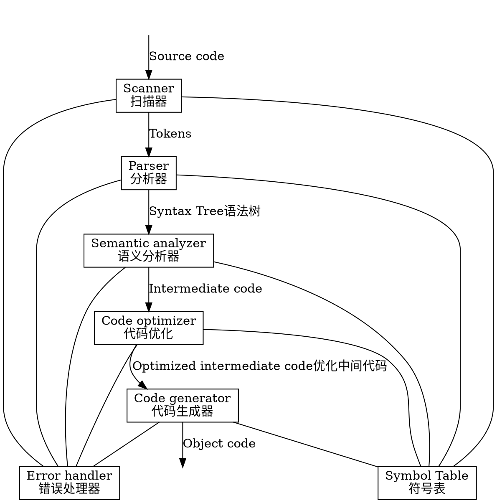
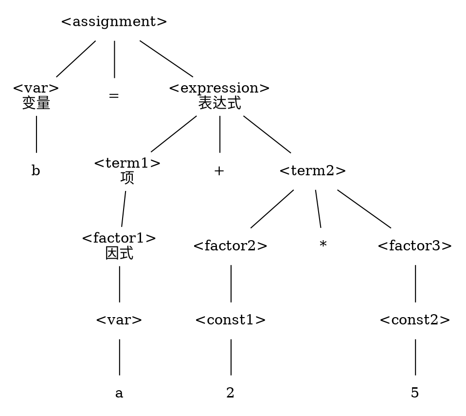
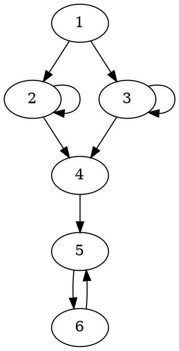
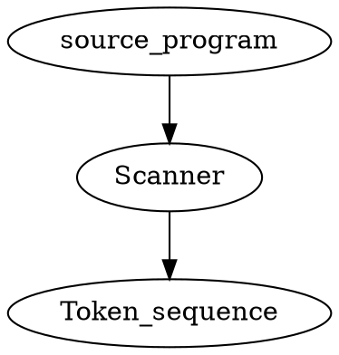
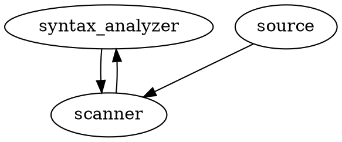
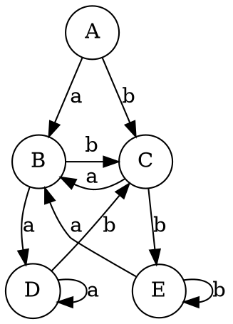
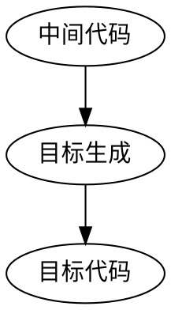

# 总过程



## Scanner
1. keyword 关键词 k
2. identifier 标识符 i
3. const 常量 c
4. delimiter 界符 p

## Parser





# Chapter 4 词法分析
词法分析器也叫扫描器  
两个任务
1. 识别单词——把单词从源程序中分离开
2. 翻译单词——吧识别出的单词翻译成相应的token
## 识别单词
### 单词分类
根据语法功能分类
* 标识符Identifier——变量名、函数名、类名等
* 关键字Keywords——由系统定义好的，用来区分不同的语法单元
* 常量Constant——以它自身的形式存在
* 界符Delimiter——
    * 单字——+ -
    * 双字——<> ==
### 单词识别
1. 以字母开头——关键字或标识符
2. 以数字开头——数字型常量
3. 以‘或“开头——字符型常量或字符串常量
4. 其他的——以它自身形式显示

**如何区分关键字和标识符？**
大多数语言的关键字是**保留的**，标识符不能和关键字同名
去关键字表中查找，找到了就是关键字

### Token
单词长度不一样，格式不一样
token能实现
1. 长度一致
2. 语法信息和语义信息分离开
token二元组 type|value
type存储语法信息，比如单词类型
value存储语义信息，比如数组维数、上界、数据类型

用指针设计token
四个指针分别指向一个表

## 设计词法分析器
###词法分析器可以分为两种类型
1. 一个单独的扫描器

2. 将扫描器作为语法分析器的子程序来调用

通常是第二种方式

扫描器内部通常是一样的

识别器——一个识别单词的有限自动机

翻译器——将单词翻译成token


1. 识别器——返回已识别的单词
2. 常数处理——把字符型转换成数值型

## 算术常数处理机的设计

带有翻译功能的自动机称为处理机，包含两个部分
1. 识别器（有限自动机），主程序
2. 翻译机，子程序，插入到有限自动机的结点之中

**功能是把字符串型变换成数值型**

### 识别器
算术常量的基本形式
ddddd...d e(+|-)ddd...d

### 翻译器
1. 算法：下列参数
初始值：n=p=m=t=0;e=1
n:拼尾数值变量
    每当读入尾数数字d时，n=10*n+val(d);
p:拼指数值变量
    每当读入指数数字p时，p=10*p+val(d);
m:小数位数变量
    读到小数点后，每当读入小数数字d时，m=m+1
e:指数的符号变量（+为1，-为-1）
t:类型变量(整型为0，实型为1)
Result: 
```tex
num= n*10^{e*p-m}
```

2. 每个结点的功能
q1: Initialization,n=p=m=t=0;e=1;num=0;
q2:n=10*n+val(d);
q3:t=1;
q4:n=10*n+val(d); m=m+1;
q5:t=1;
q6:if'-' then e=-1;
q7:p=10*p+val(d);

```flow
st=>start: 开始
op1=>operation: state=1
op2=>operation: Semfun(state)
op3=>operation: getchar(ch)
op4=>operation: 查变换表：δ(state,ch)=?
con1=>condition: δ=empty
con2=>condition: δ=ok
op5=>operation: state=δ
io=>inputoutput: reject
op6=>operation: Result:num=n*10^{e*p-m}
ed=>end: 结束

st->op1->op2->op3->op4->con1
con1(yes)->io->ed
con1(no)->con2(no)->op5(top)->op2
con2(yes)->op6->ed
```
# Chapter 5 语法分析

识别语法结构，检查语法错误，输出语法树作为结果

## 语法分析的分类
推导和规约都行
1. 自顶向下：语法树从根结点开始构造，采用**最左推导**
2. 自底向上：语法树从叶子节点开始构造，采用**最左规约**

以算术表达式为例

自底向上方法的关键是如何确定当前句子的句柄
## 递归子程序
### 递归子程序的规则
1. 对于每个非终结符都设定一个子程序，用来识别它定义的符号串
2. 每个子程序以相应的非终结符命名
3. 子程序的内容由产生式右部组成


```flow
st=>start: 入口
ed=>end: 出口
a=>condition: a?
b=>condition: b?
e=>condition: e?
c=>condition: c?
e1=>inputoutput: err1
e2=>inputoutput: err2
n1=>operation: NEXT(w)
n2=>operation: NEXT(w)
n3=>operation: NEXT(w)
n4=>operation: NEXT(w)
A=>subroutine: A
B=>subroutine: B
D=>subroutine: D
st->a
a(yes)->n1->B->e
e(yes)->n2->D->ed
e(no)->e1
a(no)->b
b(yes)->n3->A->c
c(yes)->n4->ed
c(no)->e2
b(no)->ed
```


1. 扩展文法
    添加一个产生式Z`->Z作为主方法
2. 进入和退出
    子程序入口时，其**首符号**已经读来！
    子程序出口时，其**后继符**应该读来!
3. 设计子程序
    * 遇到终结符，判断与当前单词是否相符，确认是后读取下一单词
    * 遇到非终结符，调用该非终结符表示的子程序，返回后不读取下一单词
    * 遇到空串，直接转出口

### 限制文法
递归子程序将产生式的第一个符号与当前单词相匹配，以便决定用哪个产生式进行推导

限制：
1. 具有相同左部的产生式右部首符号不同
2. 不能有左递归

错误例子
1.  A->aA|aB
2.  A->Ab|a

即要求文法是LL(1)文法

通过等价变化消除左递归

```java
public static void main(String args[]){
    System.out.println("Hello");
}
```



## LL(1)分析法
* 第一个L代表从左向右
* 第二个L代表最左推导
* 1表示向前查看的符号的个数
    LL(1)又称预测分析法，是没有回溯的（确定的）自顶向下语法分析方法

三个关键点
1. 分析栈记录着分析的过程
2. 分析表记录如何去选择产生式
3. 文法必须是LL(1)文法

例子
>文法G(Z)：
 Z -> dAZ | bAc
 A -> aA |ε

处理字符串 
```tex
\alpha=bac\#
```


|分析栈|当前符号|剩下的符号|选择产生式或者匹配
|-----|--------|---------|---------
|#Z  |b       |ac#      |Z->bAc
|#cAb|b       |ac#      |b被匹配到
|#cA |a       |c#       |A->aA
|#cAa|a       |c#       |a被匹配到
|#cA |c       |#        |A->ε
|#c  |c       |#        |c被匹配到
|#   |#       |         |OK

* **选择推导产生式后，要逆序压栈**
* **c∈follow(A),要选择A->ε这个产生式，因为在栈中后面元素中很可能出现c，就可以与当前单词c进行匹配**
* **最右一列：推导所用产生式或匹配**

### LL(1)分析算法
1. 若 栈顶符=A,当前符 w=a, 设有产生式：                     
          A->aα，  则  POP,PUSH
```tex
(aα)^R
``` 
; R代表逆向 
2. 若 栈顶符=a,当前符 w=a； 则  POP,NEXT(w);

## LL(1)文法
文法决定了分析表
1. first follow和select
first(a)是从a能推导出的所有首符号
2. follow(A)是所有句型中紧跟在A之后出现的终结符。
3. 
```tex
select(A \rightarrow a)=
\begin{cases}
first(\alpha) & \alpha \nRightarrow ^ *\varepsilon \\
first(\alpha)\cup follow(\alpha)& \alpha\Rightarrow^*\varepsilon
\end{cases}
```
    * 如果产生式右侧有终结符号，则肯定为第一种情况
    * 如果产生式右侧只含有非终结符号，才有可能为第二种情况
4. 若 α=ε  则 first(α)={ }；
5. 设 # 为输入串的结束符，则 #∈follow(Z); 

求 follow(A) 要点：
  * 查所有右部含有A的产生式: B -> …Aβ
         ① 若 β 不空时 , 则 first(β)∈follow(A) ；   
         ② 若 β 取空时 , 则 follow(B)∈follow(A) ； 
         ③ 若 β = ε 时 , 则 follow(B)∈follow(A)。

**具有相同左部的产生式的select集不相交即为LL(1)文法**

```flow
b=>start: begin
op1=>operation: PUSH(#),PUSH(Z)
op2=>operation: NEXT(w)
op3=>operation: POP(x)
vt=>condition: x
```
分析表
行代表非终结符号
列代表终结符号
表项代表产生式

## LR()分析
和LL(1)相比
优点：
* 文法限制少
* 更快更准确地进行错误的定位

缺点
* 实现比较困难，要构造句柄识别器

LR(k)
L：从左向右扫描
R：最左规约
k：下一个读的单词数量

三点关键
1. 分析栈
2. 如果栈顶有句柄，进行规约，否则移进
3. 构造类似于DFA的句柄识别器

栈一开始压#，最后剩开始符号

### 句柄识别器
1. LR(0)项：产生式右侧加一个点·
>点的左侧表示已经识别出的字符串
 点的右侧表示我们期望读的字符串

2. 扩展文法
3. LR(0)项分类
* 规约项目： A->a· 产生式的右部已经分析完
* 移进项目：
```tex
A\rightarrow \alpha·ab
```
期待移进一个符号a
* 待约项目：A->a·Bb 期待归约得到B
* 接受项目： S'->S· 整个句子分析完毕
4. DFA的状态：多个LR(0)项目工程一个识别器的状态
5. 闭包(I)：I是LR(0)项目集
若项目A   ∙ B∈ closure( I )，则对所有
     B  r ∈ P，项目B  ∙ r ∈ closure( I );

## 闭包
##变换函数
## LR()分析器
四种方法

由于文法的内容和形式不同，导致构造句柄难度也不同

LR(0)控制器加上LR分析表
识别器有多少状态分析表就有多少

# Chapter 6 语义分析
## 静态语义审查
## 如果静态语义正确，生成中间代码

中间代码设置的目的
1. 便于进行与机器无关的代码优化
2. 使得编译程序改变目标机更容易
3. 使编译程序的结构在逻辑上更为简单明确，以中间语言为界面，编译前端和后端的接口更清晰

## 四元式设计
1. 表达式
基本形式: 
```tex
q:(\omega\  o1\  o2\  t)
```
2. 
3.
4.
5. while循环的四元式设计
q1(wh _ _ _)  
    quat(E)
q2(do res(E) _ _)
    quat(S)
q3(we _ _ __)

q1:while语句的入口四元式（提供转向E参照）
q2:当res(E)=false转向出口四元式
q3:while尾（兼循环转向E）四元式 we=while end

## 语法制导翻译
### 属性文法
是上下文无关文法在**语义**上的扩展，是一种接近形式化的语义描述方法，可定义为如下三元组
1. 属性代表与文发符号相关的信息，这里主要指语义信息；文法产生式中的每个文法符号都附有若干个这样的属性
2. 属性可以进行计算和传递，语义规则就是在同一个产生式中，相互关联的属性求值规则
3. 属性分两类
* 综合属性：其值由子女属性值来计算（自底向上求值）
* 继承属性：其值由父兄属性值来计算（自顶向下求值）

# 优化
## 分类
根据是否涉及具体的计算机来划分
1. 与机器无关的优化（在源代码或中间代码级上进行）
    1. 全局优化-针对整个源程序
    2. 局部优化-除全局优化之外都是
    3. 循环优化-对循环语句实施的优化
2. 与机器有关的优化（目标代码级上的优化）
    1. 寄存器分配的优化
    2. 消除无用代码

## 局部优化
### 常见的局部优化方法
1. 常值表达式节省（常数合并）
    如a=5+3可以优化为a=8
2. 公共子表达式节省（删除多余运算）
    如a=b*d+1; e=b*d-2;  e*d是公共表达式
    可优化为t=b*d
    若b=b*d+1; e=b*d-2; 则b*d不是公共表达式
3. 删除无用赋值
    如a=b+c;x=d-e;y=b;a=e-h/5 则a=b+c是无用赋值
4. 不变表达式外提（循环优化之一）
    把循环不变运算，提到循环外
    如i=1;while(i<100){x=(k+a)/i;...;i++}
5. 消减运算强度（循环优化之二）
    把运算强度大的运算换算成强度小的运算

### 基本块及其划分
局部优化算法以基本块为单位进行
基本块是程序中一段顺序执行的语句序列，只有一个入口和一个出口
1. 确定入口语句
    1. 程序的第一个语句或转向语句转移到的语句
    2. 紧跟在转向语句后面的语句
2. 确定出口语句
    1. 下一个入口语句的前导语句
    2. 转向语句
    3. 停语句

### 优化的基本内容
1. 常值表达式节省
    1. 先计算出常值的值
    2. 将常值的变量用常值代替
2. 公共子表达式节省
    1. 找公共表达式，建立结果变量等价关系
    2. 用老变量来代替新变量
3. 删除无用赋值
    1. 确认一个变量两个赋值点间无引用点
    2. 前一赋值点为无用赋值

### 基于DAG的局部优化方法
DAG是指无环有向图，所有箭头都向下。这里用来对基本块内的四元式序列进行优化
1. DAG的结点内容及其表示
    ni:结点的编码 ω：运算符
    M：主标记（运算结果变量，叶节点时，是变量或常数的初值）
    Ai：附加标记（运算结果变量，表示它具有该结点所代表的值，可设置多个）
    后继是运算对象、前驱是调用的
2. 单个四元式的DAG表示
    赋值A=B 用DAG表示：ni B|A
    双目运算 A=BωC 
    单目运算
    数组变量赋值运算A=B[C]
    转向语句

DAG格式不关键，最终目的是要得到优化后的四元式序列
1. 构造基本块内优化的DAG

# Chapter 8 目标代码及其生成
目标代码生成是编译的最后一个阶段

## 目标代码选择问题
大多数编译程序不产生绝对地址的机器代码，而是以汇编语言程序作为输出
此外，指令集的选择以及指令的执行速度问题都是重要因素
为了使算法具有通用性，这里采用的是
### 虚拟机及其指令系统
* 虚拟机寄存器 R0,R1,...,Rn-1
* 虚拟机指令系统
    * 指令的基本形式 op Ri,Rj/M

#### 常用指令
* 取、存
 LD Ri,Rj/M ...... Ri=(Rj/M)
 ST Ri,Rj/M ...... Rj/M=(Ri)
* 转向
 FJ Ri,M
 TJ Ri,M
 JMP_,M
* 算术运算
 ADD Ri,Rj/M
* 关系逻辑运算

### 活跃变量与非活跃变量
1. 变量的定义点和应用点
四元式 q(omega B C A) BC的应用点q，A的定义点q
2. 活跃变量与非活跃变量
一个变量从某时刻q起，到下一个定义点止，其间若有应用点，则称该变量在q是活跃的(y)，否则称该变量在q是非活跃的(n)

假定
1. 临时变量在基本块出口后是非活跃的
2. 非临时变量在基本块出口后是非活跃的

### 寄存器的分配问题
寄存器操作快且指令短，如何充分利用它
1. 设置描述表，记录寄存器和变量的当前状态
    1. 某个寄存器保留着哪个变量的值
    2. 某个变量的值是在某寄存器中还是在内存中
2. 寄存器分配规则：设当前四元式：q:A=BωC
    1. 主动释放 如果B已经在寄存器Ri中，则选择Ri：
        * 若B活跃，则要保存B的值，方法是：若有空闲的寄存器Rj，则生成ST Ri,Rj;
    否则生成指令ST Ri,B
        * 修改描述表：在Ri中删除B，填写A
    2. 选空闲者 从空闲寄存器中选一Ri
    并把A填入Ri的描述表中
    3. 强迫释放 剥夺一个Ri，具体处理办法同规则1

### 目标代码生成问题
目标代码生成是以基本块为单位的，在生成目标代码时要注意如下三个问题：
1. 基本块开始时所有寄存器应是空闲的；基本块结束时应释放所占用的寄存器
2. 一个变量被赋值时，要分配一个寄存器保留其值，并且要填写相应的描述表
3. 为了生成高效的目标代码，生成算法中要引用寄存器的分配原则和变量的活跃信息

## 一个简单代码生成器设计
1. 生成环境
* 虚拟机
* 表、区和栈
* 变量和函数