## 第一章 绪论
数据元素    数据对象

### 逻辑结构
* **线性结构**
* **集合结构**
* **树形结构**
* **图形结构**

### 物理结构（存储结构）
* 数组（顺序存储结构）
* 链表（链式存储结构）

### ADT-abstract data type 抽象数据类型
#### 定义
一个数学模型以及定义在该模型上的一组操作
#### 一般描述形式
```
ADT 抽象数据类型名称 {
    数据对象：
    ……
    数据关系：
    ……
    操作集合：
    操作名1：
    ……
    ……
    操作名n：
}
```
#### 例子 
ADT 自然数
* Objects: 从0到无穷大的整数
* Functions: + - * / =
#### 关键
使用它的人可以只关心它的逻辑特征，不需要了解它的存储方式。定义它的人同样不必要关心它如何存储。
#### ADT的两个步骤
1. 实现ADT（封装）
2. 使用ADT

实现和使用隔离

### 算法
#### 算法满足
* 输入
* 输出
* 确定性
* 有穷性
* 有效性

#### 衡量算法的标准
* Correctness 正确性
* Readability 可读性
* Robustness 健壮性
* Usability 可用性
* Simplicity 简洁性
* **Efficiency 效率**（核心的）

#### 衡量效率的指标
* 时间
* 内存空间

#### 时间复杂度
##### 大O表示法
一个语句的频度是指该语句在算法中被重复执行的次数。算法中所有语句的频度之和记为**T(n)**，它是该算法问题规模n的函数，时间复杂度主要分析T(n)的数量级。算法中基本运算（*最深层循环内*的语句）的频度与T(n)同数量级，因此通常采用算法中基本运算的频度f(n)来分析算法的时间复杂度。因此，算法的时间复杂度记为
```tex
T(n)=O(f(n))
```
O的含义是T(n)的数量级，其严格的数学定义是：若T(n)和f(n)是定义在正整数集合上的两个函数，则存在正常数C和n0，使得当n!=n0时，都满足0<=T(n)<=Cf(n).图示如下：


可以总结为: 
**<font color=darkblue>T(n)增长率小于等于f(n)</font>**

##### 除此之外的表示法
* 
```tex
T(n)=\Omega(g(n))
```

T(n)增长率大于等于g(n)
* 
```tex
T(n)=\Theta(b(n))
```

T(n)增长率等于b(n)
* 
```tex
T(n)=o(p(n))
```

T(n)增长率小于p(n)

---

* **最坏时间复杂度**是指在最坏情况下，算法的时间复杂度
* **平均时间复杂度**是指所有可能输入实例在等概率出现的情况下，算法的期望运行时间
* **最好时间复杂度**是指在最好情况下，算法的时间复杂度

一般总是考虑最坏时间复杂度，以保证算法的运行时间不会比它更长

##### 加法规则
```tex
T(n)=T_1(n)+T_2(n)=O(f(n))+O(g(n))=O(max(f(n),g(n)))
```
##### 乘法规则
```tex
T(n)=T_1(n)\times T_2(n)=O(f(n))\times O(g(n))=O(f(n)\times g(n))
```

##### 常见的时间复杂度
```tex
O(1)<O(\log_2 n)<O(n)<O(n\log_2 n)<O(n^2)<O(n^3)<O(2^n)<O(n!)<O(n^n)
```

##### T(n)写法
1. 忽略常数
不能写
```tex
O(2n^2)
```
，得写成
```tex
O(n^2)
```
2. 忽略低次项
不能写
```tex
O(n^2+n)
```
，得写成
```tex
O(n^2)
```
#### 空间复杂度
算法的空间复杂度S(n)定义为该算法所耗费的存储空间，它是问题规模n的函数。记为
```tex
S(n)=O(g(n))
```
## 第二章 线性表
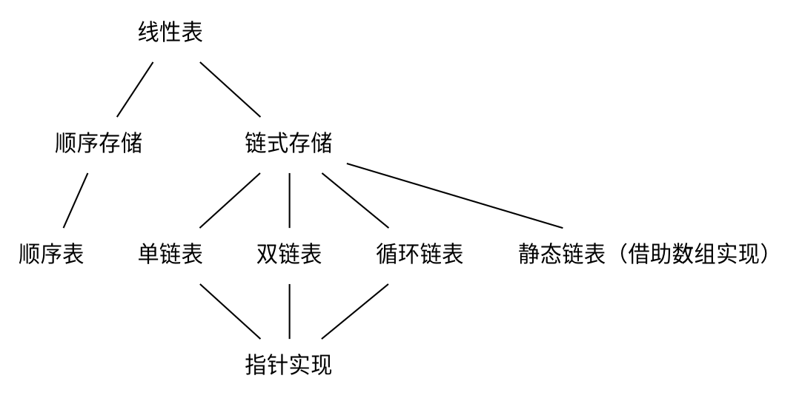

### 定义和基本操作
#### 定义
**线性表**是具有**相同**数据类型的n个数据元素的**有限**序列，其中n为表长，当n=0时该线性表是一个空表。若用L命名线性表，则其一般表示为
```tex
L=(a_1,a_2,...,a_i,a_{i+1},...,a_n)
```

#### 特点
* 表中元素个数有限
* 表中元素具有逻辑上的顺序性，在序列中各元素排序有其先后次序
* 表中元素都是数据元素，每个元素都是单个元素
* 表中元素的数据类型都相同，这意味着每个元素占有相同大小的存储空间
* 表中元素具有抽象性，即仅讨论元素间的逻辑关系，而不考虑元素究竟表示什么内容

**注意：线性表是一种逻辑结构，表示元素之间一对一的相邻关系。顺序表和链表是指存储结构，两种属于不同层面的概念，因此不要将其混淆**

#### 基本操作
* InitList(&L): 初始化表。构造一个空的线性表
* Length(L): 求表长。返回线性表的长度
* LocateElem(L,e): 按值查找操作。在表中查找具有给定关键字值的元素
* GetElem(L,i): 按位查找操作。获取表中的第i个位置的元素的值
* ListInsert(&L,i,e): 插入操作。在表中的第i个位置上插入指定元素e
* ListDelete(&L,i,&e): 删除操作。删除表中第i个位置的元素，并用e返回删除元素的值
* PrintList(L): 输出操作。按前后顺序输出线性表的所有元素值
* Empty(L): 判空操作。若L为空表，则返回true，否则返回false
* DestroyList(&L): 销毁操作。销毁线性表，并释放线性表L所占用的内存空间

### 线性表的顺序表示
#### 顺序表的定义
线性表的顺序存储又称**顺序表**。它是用一组地址连续的存储单元依次存储线性表中的数据元素，从而使得逻辑上相邻的两个元素在物理位置上也相邻。第一个元素存储在线性表的起始位置，第i个元素的存储位置后面紧接着存储的是第i+1个元素。

假定线性表的元素类型为ElemType，则线性表的顺序存储类型描述为
```c
#define MaxSize 50  //定义线性表的最大长度
typedef struct {
    ElemType data[MaxSize]; //顺序表的元素
    int length; //顺序表的当前长度
}SqList;    //顺序表的类型定义
```

##### 特点
* 表中元素的逻辑顺序与其物理顺序相同
* **随机访问**，即通过首地址和元素序号可在时间O(1)内找到指定的元素
* 存储密度高，每个节点只存储数据元素
* 插入和删除操作需要移动大量元素

#### 基本操作的实现
1. **插入操作**
在顺序表L的第i个位置插入新元素e。若i的输入不合法，则返回false，表示插入失败；否则，将顺序表的第i个元素及其后的所有元素右移一个位置，腾出一个空位置插入新元素e，顺序表长度增加1，插入成功，返回true
```c
bool ListInsert(SqList &L,int i,ElemType e) {
    if(i<1||i>L.length+1)   //判断i的范围是否有效
        return false;
    if(L.length>=MaxSize)   //当前存储空间已满，不能插入
        return false;
    for(int j=L.length;j>=i;j--)    //将第i个元素及之后的元素后移
        L.data[j]=L.data[j-1];
    L.data[i-1]=e;  //在位置i处放入e
    L.length++;    //线性表长度加1
    return true;
}
```

最好情况：在表尾插入（即i=n+1），元素后移语句将不执行，时间复杂度为O(1)
最坏情况：在表头插入（即i=1），元素后移语句将执行n次，时间复杂度为O(n)
平均情况：n/2次

因此线性表插入算法的平均时间复杂度为O(n)

2. **删除操作**
删除顺序表L中第i个位置的元素，若成功则返回true，并将被删除的元素用引用变量e返回，否则返回false
```c
bool ListDelete(SqList &L,int i,Elemtype &e) {
    if(i<1||i>L.length) //判断i的范围是否有效
        return false;
    e=L.data[i-1];  //将被删除的元素赋值给e
    for(int j=i;j<L.length;j++) //将第i个位置后的元素前移
        L.data[j-1]=L.data[j];
    L.length--; //线性表长度减1
    return true;
}
```
最好情况：删除表尾元素（i=n），无须移动元素，时间复杂度为O(1)
最坏情况：删除表头元素（i=1），需要移动除第一个元素外的所有元素，时间复杂度为O(n)
平均情况：(n-1)/2次

因此线性表删除算法的平均时间复杂度为O(n)

3. **按值查找**
在顺序表L中查找第一个元素值等于e的元素，并返回其位序
```c
int LocateElem(SqList L,ElemType e) {
    int i;
    for(i=0;i<L.length;i++)
        if(L.data[i]==e)
            return i+1; //下标为i的元素值等于e，返回其位序i+1
    return 0;   //退出循环，说明查找失败
}
```
最好情况：查找的元素就在表头，仅需比较一次，时间复杂度为O(1)
最坏情况：查找的元素在表尾（或不存在时），需要比较n次，时间复杂度为O(n)
平均情况：假设pi是查找的元素在第i个位置上的概率，则平均次数为
```tex
\sum^n_{i=1}p_i\times i=\sum^n_{i=1}\frac{1}{n}\times i=\frac{1}{n}\frac{n(n+1)}{2}=\frac{n+1}{2}  
```
次  
因此线性表查找算法的平均时间复杂度为O(n)

### 线性表的链式表示
#### 单链表的定义
线性表的链式存储又称**单链表**，它是指通过一组任意的存储单元来存储线性表中的数据元素。为了建立数据元素之间的线性关系，对每个链表节点，除存放元素自身的信息外，还需要存放一个指向其后继的指针。

单链表中结点类型的描述如下：
```c
typedef struct LNode {  //定义单链表节点类型
    ElemType data;  //数据域
    struct LNode *next; //指针域
} LNode,*LinkList;
```

* 优点：不需要大量连续存储空间
* 缺点：附加指针域浪费存储空间

**特点**：非随机存取的存储结构，即查找某个特定的节点时，需要从表头开始遍历，依次查找

通常用头指针来表示一个单链表，如单链表L，头指针为NULL时表示一个空表。此外，为了操作上的方便，在单链表第一个节点之前附加一个节点，称为**头结点**。头结点的数据域可以不设任何信息，也可以记录表长等相关信息。头结点的指针域指向线性表的第一个元素节点，如图所示：


头结点和头指针的区分：不管带不带头结点，头指针始终指向链表的第一个节点，而头结点是带头结点的链表中的第一个节点，节点内通常不存储信息

引入头结点后，可以带来两个优点：
1. 由于开始节点的位置被存放在头结点的指针域中，所以在链表的第一个位置上的操作和在表的其他位置上的操作一直，无须进行特殊处理
2. 无论链表是否为空，其头指针都是指向头结点的非空指针（空表中头结点的指针域为空），因此空表和非空表的处理也就得到了统一

#### 单链表上基本操作的实现
1. **采用头插法建立单链表**
每次将读入的新节点插入链表的表头，即头结点之后
```c
LinkList List_HeadInsert(LinkList &L) {
    LNode *s;int x;
    L=(LinkList)malloc(sizeof(LNode));  //创建头结点
    L->next=NULL;   //初始为空链表
    scanf("%d",&x); //输入节点的值
    while(x!=9999) {    //输入9999表示结束
        s=(LNode*)malloc(sizeof(LNode));    //创建新节点
        s->data=x;
        s->next=L->next;
        L->next=s;  //将新节点插入表中，L为头指针
        scanf("%d",&x);
    }
    return L;
}
```
采用头插法建立单链表时，读入数据的顺序与生成的链表中的元素的顺序是相反的。每个节点插入的时间为O(1)，设单链表长为n，则总时间复杂度为O(n)

2. **采用尾插法建立单链表**
增加一个尾指针r，使其始终指向当前链表的尾结点
```c
LinkList List_TailInsert(LinkList &L) {
    //从表头到表尾正向建立单链表，每次均在表尾插入元素
    int x;  //设元素类型为整型
    L=(LinkList)malloc(sizeof(LNode));
    LNode *s,*r=L;  //r为表尾指针
    scanf("%d",&x); //输入节点的值
    while(x!=9999) {    
        s=(LNode*)malloc(sizeof(LNode));
        s->data=x;
        r->next=s;
        r=s;
        scanf("%d",&x);
    }
    r->next=NULL;   //尾结点指针置空
    return L;
}
```
因为附设了一个指向表尾节点的指针，故时间复杂度和头插法的相同

3. **按序号查找节点值**
在单链表中从第一个节点出发，顺指针next域逐个往下搜索，直到找到第i个节点为止，否则返回最后一个节点指针域NULL
```c
LNode *GetElem(LinkList L,int i) {
    //本算法取出单链表L（带头结点）中第i个位置的节点指针
    int j=1;    //计数，初始为1
    LNode *p=L->next;   //头结点指针赋给p
    if(i==0)
        return L;   //若i等于0，则返回头结点
    if(i<1)
        return NULL;    //若i无效，则返回NULL
    while(p&&j<i) { //从第1个节点开始找，查找到第i个节点
        p=p->next;
        j++;
    }
    return p;   //返回第i个节点的指针，如果i大于表长，p=NULL，直接返回p即可
}
```

按序号查找操作的时间复杂度为O(n)

4. **按值查找表节点**
从单链表的第一个节点开始，由前往后依次比较表中各节点数据的值，若某节点数据域的值等于给定值e，则返回该节点的指针；若整个单链表中没有这样的节点，则返回NULL
```c
LNode *LocateElem(LinkList L,ElemType e) {
    //本算法查找单链表L（带头结点）中数据域值等于e的结点指针，否则返回NULL
    LNode *p=L->next;
    while(p!=NULL&&p->data!=e)  //从第1个结点开始查找data域为e的结点
        p=p->next;
    return p;   //找到后返回该结点指针，否则返回NULL
}
```

5. **插入结点操作**
插入结点操作将值为x的新结点插入到单链表的第i个位置上。先检查插入位置的合法性，然后找到待插入位置的前驱结点，即第i-1个结点，再在其后插入新结点

代码片段如下
```c
p=GetElem(L,i-1);   //查找插入位置的前驱结点
s->next=p->next;
p->next=s;
```
本算法主要的时间开销在于查找第i-1个元素，时间复杂度为O(n)。若在给定的结点后面插入新结点，则时间复杂度仅为O(1)

6. **删除结点操作**
删除结点操作是将单链表的第i个结点删除。先检查删除位置的合法性，然后查找表中第i-1个结点，即被删结点的前驱结点，再将其删除。

假设结点*p为找到的被删结点的前驱结点，为实现这一操作后的逻辑关系的变化，仅需修改*p的指针域，即将*p的指针域next指向*q的下一结点。代码片段如下：
```c
p=GetElem(L,i-1);   //查找删除位置的前驱结点
q=p->next;  //令q指向被删除结点
p->next=q->next;    //将*q结点从链中“断开”
free(q);    //释放结点的存储空间
```
和插入算法一样，该算法的主要时间也耗费在查找操作上，时间复杂度为O(n)

7. **求表长操作**
求表长操作就是计算单链表中数据结点（不含头结点）的个数，需要从第一个节点开始顺序依次访问表中的每个结点，为此需要设置一个计数器变量，每访问一个结点，计数器加1，知道访问到空节点位置。算法的时间复杂度为O(n)

#### 双链表
双链表结点中有两个指针prior和next，分别指向其前驱结点和后继结点
```c
typedef struct DNode {  //定义双链表结点类型
    ElemType data;  //数据域
    struct DNode *prior,*next;  //前驱和后继指针
} DNode, *DLinklist;
```

双链表仅在单链表的结点中增加了一个指向其前驱的prior指针，因此在双链表中执行按值查找和按位查找的操作与在单链表中的相同。但双链表在插入和删除操作的实现上，与单链表有着较大的不同。这是因为“链”变化时也需要对prior指针做出修改

1. **双链表的插入操作**
在双链表中p所指的结点之后插入结点*s，代码片段如下
```c
s->next=p->next;    //将结点*s插入到结点*p之后
p->next->prior=s;
s->prior=p;
p->next=s;
```
上述代码的语句顺序不唯一，但也不是任意的。前两句必须在第四局之前，否则*p的后继指针就会丢掉，导致插入失败

2. **双链表的删除操作**
删除双链表中节点*p的后继结点*q，代码片段如下
```c
p->next=q->next;
q->next->prior=p;
free(q);    //释放结点空间
```

#### 循环链表
1. **循环单链表**
循环单链表和单链表的区别在于，表中最后一个节点的指针不是NULL，而改为指向头结点，从而整个链表形成一个环，如图

循环单链表中没有指针域为NULL的结点，因此它的判空条件不是头结点的指针是否为空，而是它是否等于头指针

2. **循环双链表**
头结点的prior指针还要指向表尾结点，如图

在循环双链表L中，某结点*p为尾结点时，p->next==L;当循环双链表为空表时，其头结点的prior域和next域都等于L

#### 静态链表
借助数组来描述线性表的链式存储结点，结点也有数据域和指针域，与前面的链表中的指针不同的是，这里的指针是结点的相对地址（数组下标），又称**游标**。和顺序表一样，静态链表也要预先分配一块连续的内存空间，如图

静态链表结构类型的描述如下：
```c
#define MaxSize 50  //静态链表的最大长度
typedef struct {    //静态链表结构类型的定义
    ElemType data;  //存储数据元素
    int next;       //下一个元素的数组下标
} SLinkList[MaxSize];
```
静态链表以next==-1来作为其结束的标志。总体来说，静态链表没有单链表使用起来方便吗，但在一些不支持指针的高级语言（如Basic）中，这是一种非常巧妙的设计方法

#### 顺序表和链表的比较
1. **存取方式**
顺序表可以顺序存取，也可以随机存取，链表只能从表头顺序存取元素
2. **逻辑结构与物理结构**
采用顺序存储时，逻辑上相邻的元素，其对应的物理存储位置也相邻。而采用链式存储时，逻辑上相邻的元素，其物理存储位置则不一定相邻，其对应的逻辑关系是通过指针链接来表示的
3. **查找、插入和删除操作**
对于按值查找，顺序表无序时，两者的时间复杂度均为O(n)；顺序表有序时，可采用这般查找，此时的时间复杂度为
```tex
O(\log_2n)
```
对于按序号查找，顺序表时间复杂度仅为O(1)，而链表则为O(n)。但链表的插入和删除操作要比顺序表方便很多。
4. **空间分配**
顺序存储在静态存储分配情形下，一旦存储空间装满就不能再加入新元素，因此需要预先分配足够大的存储空间。预先分配过大，可能导致浪费；预先分配过小，可能导致溢出。动态存储分配虽然存储空间可以扩充，但需要移动大量元素，导致操作效率降低，而且若内存中没有更大块的连续存储空间，则会导致分配失败。链式存储的结点空间只在需要时申请分配，只要内存有空间就可以分配，操作灵活、高效

##### 在实际中应该怎样选取存储结构
1. **基于存储的考虑**
难以估计线性表的长度或存储规模时，不宜采用顺序表；链表不用事先估计存储规模，但链表的存储密度较低，显然链式存储结构的存储密度是小于1的
2. **基于运算的考虑**
存顺序表中按序号访问的时间复杂度为O(1)，而链表中按序号访问的时间复杂度为O(n)，因此若经常做的运算是按序号访问数据元素，则显然顺序表优于链表
在顺序表中进行插入删除操作时需要移动较多的元素；在链表中进行插入删除操作时，虽然也要找插入位置，但操作主要是比较操作。从这个角度考虑显然后者优于前者
3. **基于环境的考虑**
顺序表容易实现，任何高级语言中都有数组类型；链表的操作是基于指针的，相对来讲，前者实现较为简单，这也是用户考虑的一个因素

总之两种存储结构各有长短，选择哪一种由实际问题的主要因素决定。通常较稳定的线性表选择顺序存储，而频繁进行插入、删除操作的线性表（即动态性较强）适合选择链式存储

## 第三章 栈和队列
### 栈
#### 栈的基本概念
1. **定义**
一种特殊的线性表，插入和删除在同一端，该端叫**栈顶（top）**，另一端叫**栈底（bottom）**
特点：后进先出（LIFO），故也称为后进先出的线性表

2. **基操**
* InitStack(&S): 初始化一个空栈S
* StackEmpty(S): 判断一个栈是否为空，若栈S为空则返回true，否则返回false
* Push(&S,x): 进栈，若栈S未满，则将x加入使之成为新栈顶
* Pop(&S,x):出栈，若栈S非空，则弹出栈顶元素，并用x返回栈顶元素
* GetTop(S,&x): 读栈顶元素（不弹出）
* ClearStack(&S): 销毁栈，并释放栈S所占用的存储空间（注意，符号“&”是C++特有的，用来表示引用调用，采用C语言中的指针类型“*”也可以达到传址的目的

#### 栈的顺序存储结构
1. **顺序栈的实现**
```cpp
#define MaxSize 50  //定义栈中元素的最大个数
typedef struct {
    Elemtype data[MaxSize]; //存放栈中元素
    int top;    //栈顶指针
} SqStack;
```
2. **顺序栈的基本运算**

(1) 初始化
```cpp
void InitStack(SqStack &S) {
    S.top=-1;   //初始化栈顶指针
}
```
(2) 判栈空
```cpp
bool StackEmpty(SqStack S) {
    if(S.top==-1)   //栈空
        return true;
    else    //不空
        return false;
}
```
(3) 进栈
```cpp
bool Push(SqStack &S,ElemType x) {
    if(S.top==MaxSize-1)    //栈满，报错
    return false;
    S.data[++S.top]=x;  //指针先加1，再入栈
    return true;
}
```
(4) 出栈
```cpp
bool Pop(SqStack &S,ElemType &x) {
    if(S.top==-1)   //栈空，报错
        return false;
    x=S.data[S.top--];  //先出栈，指针再减1
    return true;
}
```
(5) 读栈顶元素
```cpp
bool GetTop(SqStack S,ElemType &x) {
    if(S.top==-1)   //栈空，报错
        return false;
    x=data[S.top];  //x记录栈顶元素
    return true;
}
```

注意：这里栈顶指针指向的是栈顶元素，所以进栈时的操作是S.data[++S.top]=x,出栈时的操作是x=S.data[S.top--].若栈顶指针初始化为S.top=0，即栈顶指针指向栈顶元素的下一个位置，则会有变化

3. **共享栈**
利用栈底位置相对不变的特性，可让两个顺序栈共享一个一位数据空间，将两个栈的栈底分别设置在共享空间的两端，两个栈顶向共享空间的中间延伸


#### 栈的链式存储结构
采用链式存储的栈称为**链栈**，链栈的优点是便于多个栈共享存储空间和提高其效率，且不存在栈满溢出的情况。通常采用单链表实现，并规定所有操作都是在单链表的表头进行的。这里规定链栈没有头结点，Lhead指向栈顶元素，如图  

```cpp
typedef struct Linknode {
    ElemType data;  //数据域
    struct Linknode *next;  //指针域
} *LiStack; //栈类型定义
```
#### 栈的应用
##### 检查左右括号是否匹配
扫描，碰见左括号入栈，碰见右括号就弹栈进行比对，若为空就报错  
结束时，如果栈不为空，则报错

##### 后缀表达式求值
扫描，碰见操作数就将它入栈，碰见运算符就弹两个操作数出栈计算后将结果入栈。结束时取出栈顶元素

##### 中缀表达式转化为后缀表达式
* 如果读到的操作数就直接输出  
* 如果读到的是运算符
    * 当读到的运算符优先级大于栈顶元素优先级或者栈为空时，将该运算符入栈
    * 当读到的是")"时，不断弹出栈顶元素并输出直到栈顶元素为"("，此时弹出"("但不输出
    * 当读到的运算符优先级小于栈顶元素优先级时，不断弹出栈顶元素并输出直到读到的运算符优先级大于栈顶元素，此时将读到的运算符入栈
* 将输入的字符序列扫描完毕后，如果栈内还有元素，就不断弹栈输出直到栈空为止

优先级如下表所示，isp是栈内优先（in stack priority)数，icp是栈外优先（in coming priority）数

|操作符 |#  |(  |*, /   |+, -   |)  |
|------|---|---|-------|-------|---|
|isp   |0  |1  |5      |3      |6  |
|icp   |0  |6  |4      |2      |1  |

##### 栈在递归中的应用
递归解题思路：把规模较大的问题缩小到一目了然

递归包含
* 基本状态（出口）
* 普通状态（递归）

递归运算相当于在栈内运算

递归函数编写不好会导致栈溢出

递归运算每增加一个数时间增长一倍
* 优点：可读性强
* 缺点：冗余太多

用递归的条件
* 深度不能太深
* 可读性明显高
* 时间在同一数量级

### 队列
#### 定义
一种操作受限的线性表，只允许在表的一端进行插入，而在表的另一端进行删除。
特点：**先进先出(FIFO)**，故又称先进先出的线性表

#### 基操
* InitQueue(&Q): 初始化队列，构造一个空队列Q
* QueueEmpty(Q): 判队列空，若队列Q为空返回true，否则返回false
* EnQueue(&Q,x): 入队，若队列Q未满，将x加入，使之成为新的队尾
* DeQueue(&Q,x): 出队，若队列Q非空，删除队首元素，并用x返回
* GetHead(Q,&x): 读队首元素，若队列Q非空，则将队首元素赋值给x

#### 队列的顺序存储
```cpp
#define MaxSize 50  //定义队列中元素的最大个数
typedef struct{
    ElemType data[MaxSize]; //存放队列元素
    int front, rear;    //队首指针和队尾指针
} SqQueue;
```

* 初始状态：Q.front\==Q.rear\==0
* 队空条件：Q.front\==Q.rear
* 进队操作：队不满时，先送值到队尾元素，再将队尾指针加1
* 出队操作：队不空时，先取队首元素值，再将队首指针加1

队列的初始状态  


如上图所示，rear=MaxSize并不能作为队列满的条件。最后一张图中队列仅有一个元素，但仍满足该条件，这是一种“假溢出”。这个问题需要循环队列来解决

#### 循环队列
把存储队列元素的表从逻辑上视为一个环，称为**循环队列**。当队首指针Q.front=MaxSize-1后，再前进一个位置就自动到0，这可以利用除法取余运算（%）来实现
* 初始时：Q.front=Q.rear=0
* 队首指针进1：Q.front=(Q.front+1)%MaxSize
* 队尾指针进1：Q.rear=(Q.rear+1)%MaxSize
* 队列长度：(Q.rear+MaxSize-Q.front)%MaxSize

按照常规做法，队空和队满时都有Q.front==Q.rear

为了区分队空还是队满的的情况，有几种处理方式
1. 牺牲一个单元来区分队空和队满，入队时少用一个队列单元，这是一种较为普遍的做法，约定以“队首指针在队尾指针的下一位置作为队满的标志”，如图  


    * 队满条件：(Q.rear+1)%MaxSize==Q.front  
    * 队空条件：Q.front==Q.rear
    * 队列中元素的个数：(Q.rear+MaxSize-Q.front)%MaxSize
2. 类型中增设表示元素个数的数据成员size
    * 队空条件：size==0
    * 队满条件：size==MaxSize
    这两种情况都有Q.front\==Q.rear

##### 以牺牲一个单元来判断队空队满的队列的操作代码
1. 初始化
```cpp
void InitQueue(SqQueue &Q) {
    Q.rear=Q.front=0;   //初始化队首指针和队尾指针
}
```
2. 判队空
```cpp
bool isEmpty(SqQueue Q){
    if(Q.rear==Q.front) //队空条件
        return true;
    else
        return false;
}
```
3. 入队
```cpp
bool EnQueue(SqQueue &Q, ElemType x){
    if((Q.rear+1)%MaxSize==Q.front)
        return false;   //队满
    Q.data[Q.rear]=x;
    Q.rear=(Q.rear+1)%MaxSize;  //队尾指针加1取模
    return true;
}
```
4. 出队
```cpp
bool DeQueue(SqQueue &Q,ElemType &x){
    if(Q.rear==Q.front)
        return false;
    x=Q.data[Q.front];
    Q.front=(Q.front+1)%MaxSize;
    return true;
}
```
#### 队列的链式存储
队列的链式存储称为**链队列**，它实际上是一个同时带有队首指针和队尾指针的单链表。头指针指向队首节点，尾指针指向队尾节点，即单链表的最后一个结点（与顺序存储不同，顺序存储的尾指针指向的是最后一个结点的下标加1）

带头结点的链式队列：


```cpp
typedef struct {    //链式队列结点
    ElemType data;
    struct LinkNode *next;
} LinkNode;
typedef struct {    //链式队列
    LinkNode *front,*rear;  //队列的队首指针和队尾指针
} LinkQueue;
```
当Q.front\==null且Q.rear\==null时，链式队列为空

##### 链式队列的基操
1. 初始化
```cpp
void InitQueue(LinkQueue &Q) {
    Q.front=Q.rear=(LinkNode*)malloc(sizeof(LinkNode)); //建立头结点
    Q.front->next=NULL; //初始为空
}
```
2. 判队空
```cpp
bool IsEmpty(LinkQueue Q) {
    if(Q.front==Q.rear)
        return true;
    else
        return false;
}
```
3. 入队
```cpp
void EnQueue(LinkQueue &Q,ElemType x) {
    LinkNode *s=(LinkNode *)malloc(sizeof(LinkNode));
    s->data=x;  
    s->next=NULL;   //创建新结点
    Q.rear->next=s; 
    Q.rear=s;   //插入到队尾
}
```
4. 出队
```cpp
bool DeQueue(LinkQueue &Q,ElemType &x) {
    if(Q.front==Q.rear)
        return false;   //空队
    LinkNode *p=Q.front->next;
    x=p->data;
    Q.front->next=p->next;
    if(Q.rear==p)
        Q.rear=Q.front; //若原队列中只有一个结点，删除后变空
    free(p);
    return true;
}
```

#### 双端队列
双端队列是指允许两端对可以进行入队和出队操作的队列。其元素的逻辑结构仍是线性结构。将队列的两端分别称为**前端**和**后端**，两端都可以入队和出队

输出受限的双端队列：允许在一段进行插入和删除，但在另一端只允许插入

输入受限的双端队列：允许在一端进行插入和删除，但在另一端只允许删除。若限定双端队列从某个端点插入的元素只能从该端点删除，则该双端队列就蜕变为两个栈底相邻接的栈

#### 队列的应用
##### 队列在层次遍历（广度优先遍历）中的应用
层次遍历二叉树的过程
1. 根节点入队
2. 若队空（所有节点都已处理完毕），则结束遍历；否则重复3.操作
3. 队列中第一个节点出队，并访问。若其有左子，则将左子入队；若其有右子，则将右子入队，返回2.
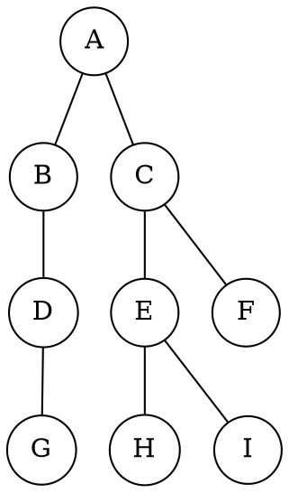
层次遍历二叉树的过程

|序 |说明       |队内   |队外       |
|---|----------|-------|-----------|
|1  |A入       |A      |           |
|2  |A出，BC入  |BC     |A         |
|3  |B出，D入   |CD     |AB        |
|4  |C出，EF入  |DEF    |ABC       |
|5  |D出，G入   |EFG    |ABCD      |
|6  |E出，HI入  |FGHI   |ABCDE     |
|7  |F出       |GHI    |ABCDEF     |
|8  |GHI出     |       |ABCDEFGHI  |

##### 队列在计算机系统中的应用
1. 解决主机与外部设备之间速度不匹配的问题
    以主机和打印机之间速度不匹配的问题为例。主机输出数据给打印机打印，输出数据的速度比打印数据的速度要快得多，由于速度不匹配，若直接把输出的数据送给打印机打印显然是不行的。解决的方法是设置一个打印数据缓冲区，主机把要打印输出的数据依次写入这个缓冲区，写满后就暂停输出，转去做其他的事情。打印机就从缓冲区中按照先进先出的原则依次取出数据并打印，打印完后再向主机发出请求。主机接到请求后再向缓冲区写入打印数据。这样做既保证了打印数据的正确，又使主机提高了效率。由此可见，打印数据缓冲区中所存储的数据就是一个队列
2. 解决由多用户引起的资源竞争问题
    在一个带有多终端的计算机系统上，有多个用户需要CPU各自运行自己的程序，它们分别通过各自的终端向操作系统提出占用CPU的请求。操作系统通常按照每个请求在时间上的先后顺序，把它们排成一个队列，每次把CPU分配给队首请求的用户使用。当相应的程序运行结束或用完规定的时间间隔后，令其出队，再把CPU分配给新的队首请求的用户使用。这样既能满足每个用户的请求，又能使CPU正常运行
	
## 第四章 树与二叉树
### 树的基本概念
#### 树的定义
树是n(n>=0)个结点的有限集合，n=0时，称为**空树**，这是一种特殊情况。在任意一棵非空树中应满足：
1. 有且仅有一个特定的称为**根**的结点
2. 当n>1时，其余结点可分为m(m>0)个互不相交的有限集合T1,T2,...,Tm,其中每个集合本身又是一棵树，并且称为根节点的**子树**

树的定义是递归的
特点：
1. 树的根节点没有前驱结点，除根节点外的所有节点有且只有一个前驱结点
2. 树中所有节点可以有零个或多个后继结点

树中某个结点（除根结点外）最多只和上一层的一个结点（即其父结点）有直接关系，根结点没有直接上层结点，因此在n个结点的树中有n-1条边

#### 树的基本术语
* 根结点
* 兄弟结点
* 内部结点：有子结点
* 外部结点（叶子结点）：没有子结点
* 祖先结点：父结点、爷爷结点、曾爷爷结点……
* 子孙结点
* 结点的深度（Depth）：祖先结点的个数
* 树的高度（Height）：深度最大值（只有根结点为0，空树为-1）
* 结点的度（Degree）：子结点个数
* 树的度：结点的度的最大值
* 子树（Subtree）
* 森林：m棵互不相交的树的集合。森林的概念与树的概念十分相近，因为只要把树的根节点删去就成了森林

#### 树的性质
1. 树的结点数等于所有结点的度数加1
2. 度为m的树中第i层上至多有$m^{i-1}$个结点（i>=1）
3. 高度为h的m叉树至多有$(m^h-1)/(m-1)$个结点
4. 具有n个结点的m叉树的最小高度为$[\log_m(n(m-1)+1)]$

### 二叉树的概念
#### 二叉树的定义及其主要特性
##### 1. 二叉树的定义
特点：  
每个节点最多有两个子结点（可以只有一个）  
子结点有序，分别称左子结点和右子结点，其次序不能任意颠倒

二叉树是有序树，即使树中节点只有一棵子树，也要区分它是左子树还是右子树

二叉树与度为2的有序树的区别：
1. 度为2的树至少有3个结点，而二叉树可以为空
2. 度为2的有序树的孩子结点的左右次序是相对于另一孩子结点而言的，若某个结点只有一个孩子结点，则这个孩子结点就无须区分其左右次序，而二叉树无论其孩子数是否为2，均需确定其左右次序，即二叉树的结点次序不是相对于另一结点而言，而是确定的

##### 2. 几个特殊的二叉树
1. 满二叉树
    树中每一个层的结点数都达到最大值。满二叉树的叶子结点都集中在二叉树的最下一层，并且除叶子结点之外的每个结点度数均为2
    按层从上往下标号，同一层从左往右标
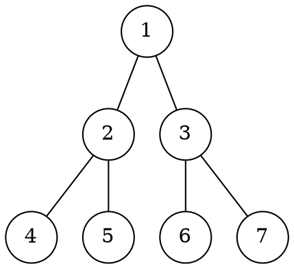
结点i的父结点编号是i/2  
结点i左子结点编号是2i  右子结点编号是2i+1  
**满二叉树用数组存最合适**

2. 完全二叉树
最后一层从右往左可以缺结点  
编号和满二叉树对应
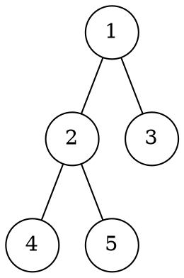

3. 二叉排序树
性质：左子树上所有结点的关键字均小于根结点的关键字；右子树上的所有结点的关键字均大于根结点的关键字。左子树和右子树又各是一棵二叉排序树

4. 平衡二叉树
树上任一结点的左子树和右子树的深度之差不超过1

##### 3. 二叉树的性质
1. 非空二叉树上的叶子结点数等于度为2的结点数加1，即n0=n2+1
2. 非空二叉树上第k层上至多有$2^{k-1}$个结点（k>=1）

#### 二叉树的存储结构
##### 1. 顺序存储结构
一般完全二叉树和满二叉树使用

将完全二叉树上编号为i的结点元素存储在某个数组下标在i-1的分量中，然后通过一些方法确定结点在逻辑上的父子和兄弟关系

对于一般的二叉树，为了让数组下标能反映二叉树中结点之间的逻辑关系，只能添加一些并不存在的空结点，让其每个结点与完全二叉树上的结点相对照  

满二叉树顺序存储:


普通二叉树顺序存储：  


##### 2. 链式存储结构
用一个链表来存储一棵二叉树，二叉树中的每个结点用链表的一个链结点来存储。在二叉树中，结点结构至少包含3个域：数据域data、左指针域lchild、右指针域rchild
```cpp
typedef struct BiTNode {
    ElemType data;  //数据域
    struct BiTNode *lchild,*rchild; //左右孩子指针
} BiTNode,*BiTree;
```


**在含有n个结点的二叉链表中，含有n+1个空链域**

### 二叉树的遍历和线索二叉树
#### 遍历
##### 1. 先序遍历
操作过程：  
若二叉树为空，则什么也不做；否则：
1. 访问根结点
2. 先序遍历左子树
3. 先序遍历后子树
```cpp
void PreOrder(BiTree T) {
    if(T!=null){
        visit(T);   //访问根结点
        PreOrder(T->lchild);    //递归遍历左子树
        PreOrder(T->rchild);    //递归遍历右子树
    }
}
```

##### 2. 中序遍历
操作过程:  
若二叉树为空，则什么也不做；否则：
1. 中序遍历左子树
2. 访问根结点
3. 中序遍历右子树
```cpp
void InOrder(BiTree T) {
    if(T!=null){
        InOrder(T->lchild);     //递归遍历左子树
        visit(T);   //访问根结点
        InOrder(T->rchild);     //递归遍历右子树
    }
}
```

##### 3. 后序遍历
操作过程：  
若二叉树为空，则什么也不做；否则：
1. 后序遍历左子树
2. 后序遍历右子树
3. 访问根结点
```cpp
void PostOrder(BiTree T) {
    if(T!=null){
        PostOrder(T->lchild);   //递归遍历左子树
        PostOrder(T->rchild);   //递归遍历右子树
        visit(T);   //访问根结点
    }
}
```

##### 4. 递归算法和非递归算法的转换
借助栈，可以将二叉树的递归遍历算法转换为非递归遍历算法。

以中序遍历为例：先扫描（并非访问）根结点的所有左结点并将它们一一进栈，然后出栈一个节点\*p（显然结点*p没有左子结点或左子结点均已访问过），访问它。然后扫描该结点的右子结点，将其进栈，再扫描该右子结点的所有左结点并一一进栈，如此继续，知道栈空为止
```cpp
void InOrder2(BiTree T) {
    InitStack(S);
    BiTree p=T; //初始化栈；p是遍历指针
    while(p||!IsEmpty(S)) { //栈不空或p不为null时遍历
        if(p) { //根指针进栈，遍历左子树
            Push(S,p);  //每遇到非空二叉树先向左走
            p=p->lchild;
        }
        else {  //根指针退栈，访问根结点，遍历右子树
            Pop(S,p);
            visit(p);   //退栈，访问根结点
            p=p->rchild;    //再向右子树走
        }
    }
}
```

##### 5. 层次遍历
借助一个队列。先将二叉树根结点入队，然后入队，访问该结点，若它有左子树，则将左子树根结点入队；若它有右子树，则将右子树根结点入队。然后出队，对出队结点访问，如此反复，直到队列为空
```cpp
void LevelOrder(BiTree T) {
    InitQueue(Q);   //初始化辅助队列
    BiTree p;
    EnQueue(Q,T);   //将根结点入队
    while(!IsEmpty(Q)) {    //队列不空循环
        DeQueue(Q,p);   //队首元素出队
        visit(p);   //访问当前p所指向结点
        if(p->lchild!=null)
            EnQueue(Q,p->lchild);   //左子树不空，则左子树入队列
        if(p->rchild!=null)
            EnQueue(Q,p->rchild);   //右子树不空，则右子树入队列
    }
}
```

##### 6. 由遍历序列构造二叉树
由二叉树的先序序列和中序序列可以唯一地确定一棵二叉树。在先序遍历序列中，第一个结点一定是二叉树的根结点；而在中序遍历中，根结点必然将中序序列分割成两个子序列，前一个子序列是根结点的左子树的中序序列，后一个子序列是根结点的右子树的中序序列

同理，由二叉树的后序序列和中序序列也可以唯一地确定一棵二叉树

例如，求先序序列（ABCDEFGHI）和中序序列（BCAEDGHFI）所确定的二叉树
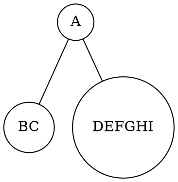
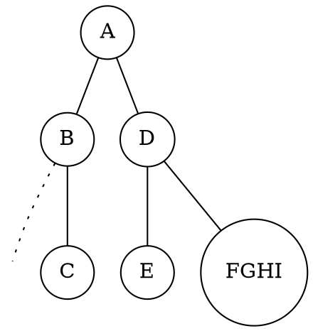
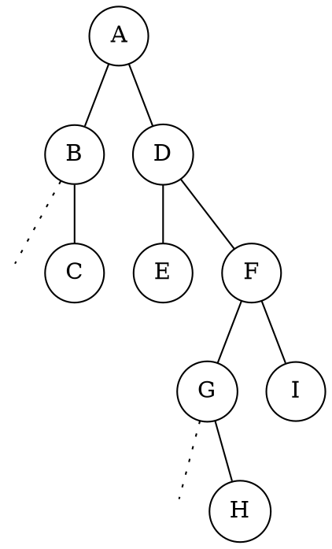

#### 线索二叉树
##### 1. 线索二叉树的基本概念
普通二叉树中存在大量的空指针（n个结点的二叉树有n+1个空指针），若利用这些空指针存放指向其直接前驱或后继的指针，则可以更方便地运用某些二叉树操作算法。引入线索二叉树是为了加快查找结点前驱和后继的速度。

线索二叉树的结点结构：
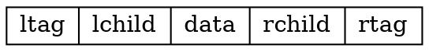

* ltag=0：lchild域指示结点的左子结点
* ltag=1：lchild域指示结点的前驱
* rtag=0：rchild域指示结点的右子结点
* rtag=1：rchild域指示结点的后继

```cpp
typedef strcut ThreadNode {
    ElemType data;  /数据元素
    struct ThreadNode *lchild,*rchild;  //左右孩子指针
    int ltag,rtag;
} ThreadNode,*ThreadTree;
```

##### 2. 线索二叉树的构造
对二叉树的线索化，实质上就是遍历一次二叉树，只是在遍历的过程中，检查当前结点左右指针域是否为空，若为空，将它们改为指向前驱结点或后继结点的线索

##### 3. 线索二叉树的遍历
非递归遍历不再需要借助栈，因为它的结点中隐含了线索二叉树的前驱和后继信息
1. 求中序线索二叉树中中序序列下的第一个结点：
```cpp
ThreadNode *Firstnode(ThreadNode *p) {
    while(p->ltag==0)
        p=p->lchild;    //最左下结点（不一定是叶子结点）
    return p;
}
```
2. 求中序线索二叉树中结点p在中序序列下的后继结点：
```cpp
ThreadNode *Nextnode(ThreadNode *p) {
    if(p->rtag==0)
        return Firstnode(p->rchild);
    else
        return p->rchild;
}
```
3. 利用上面两个算法，可以写出不含头结点的中序线索二叉树的中序遍历的算法
```cpp
void Inorder(ThreadNode *T) {
    for(ThreadNode *p=Firstnode(T);p!=null;p=Nextnode(p))
        visit(p);
}
```

### 树、森林
#### 树的存储结构
##### 1. 双亲表示法
一组连续空间来存储每个节点，同时再每个节点中增设一个伪指针，指示其双亲节点在数组中的位置。根结点下标为0，其伪指针域为-1
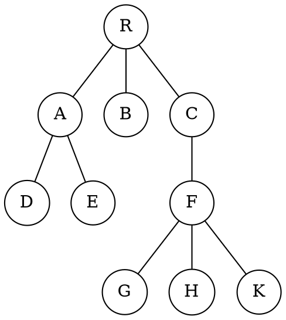

|下标|data   |parent |
|---|-------|-------|
|0  |R      |-1     |
|1  |A      |0      |
|2  |B      |0      |
|3  |C      |0      |
|4  |D      |1      |
|5  |E      |1      |
|6  |F      |3      |
|7  |G      |6      |
|8  |H      |6      |
|9  |K      |6      |

```cpp
#define MAX_TREE_SIZE 100   //树中最多结点数
typedef struct {    //树的结点定义
    ElemType data;  //数据元素
    int parent;     //双亲位置域
} PTNode;
typedef struct {    //树的类型定义
    PTNode nodes[MAX_TREE_SIZE];    //双亲表示
    int n;  //结点数
} PTree;
```

该存储结构利用了每个结点（根结点除外）只有唯一双亲的性质，可以很快得到每个结点的双亲结点，但求结点的孩子时需要遍历整个结构

##### 2. 孩子表示法
将每个结点的孩子结点都用单链表链接起来形成一个线性结构，此时n个结点就有n个孩子链表


##### 3. 孩子兄弟表示法
孩子兄弟表示法又称**二叉树表示法**，即以二叉链表作为树的存储结构。孩子兄弟表示法使每个结点包括三部分内容：结点值、指向结点第一个孩子结点的指针，及指向结点下一个兄弟结点的指针（沿次域可以找到结点的所有兄弟结点）


```cpp
typedef struct CSNode{
    ElemType data;
    Struct CSNode *firstchild,*nextsibling; //第一个孩子和右兄弟指针
} CSNode,*CSTree;
```

这种表示法比较灵活，最大的优点是可以方便地实现树转换为二叉树的操作，易于查找结点的孩子等，但缺点是从当前结点查找其双亲结点比较麻烦。若为每个结点增设一个parent域指向其父结点，则查找结点的父结点也很方便

#### 树和森林的遍历
1. 先根遍历
若树非空，则先访问根结点，再按从左到右的顺序遍历根结点的每棵子树。其访问顺序与这棵树相应二叉树的先序遍历顺序相同
2. 后根遍历
若树非空，则按从左到右的顺序遍历根结点的每棵子树，之后再访问根结点。其访问顺序与这棵树相应二叉树的先序遍历顺序相同

森林的两种遍历方法
1. 先序遍历森林。若森林非空，则按如下规则进行遍历：
    * 访问森林中第一棵树的根结点
    * 先序遍历第一棵树中根结点的子树森林
    * 先序遍历除去第一棵树之后剩余的树构成的森林
2. 中序遍历森林。若森林为非空，则按如下规则进行遍历：
    * 中序遍历森林中第一棵树的根结点的子树森林
    * 访问第一棵树的根结点
    * 中序遍历除去第一棵树之后剩余的树构成的森林

#### 树的应用——并查集
并查集是一种简单的集合表示，它支持以下3种操作：
1. Union(S, Root1, Root2): 把集合S中的子集合Root2并入子集合Root1.要求Root1和Root2互不相交，否则不执行合并
2. Find(S,x): 查找集合S中单元素x所在的子集合，并返回该子集合的名字
3. Initial(S): 将集合S中的每个元素都初始化为只有一个单元素的子集合

通常用树（森林）的双亲表示作为并查集的存储结构，每个子集合以一棵树表示

  
  
将root2并入到root1中  
  
查找x所属于的根节点（或者说是x所属于的集合），就可以一直找array[x]，直到array[x]小于0，则证明找到了根（所在集合）  


结构定义：
```cpp
#define SIZE 100
int UFSets[SIZE];   //集合元素数组（双亲指针数组）
```

初始化操作：
```cpp
void Initial(int S[]){
    for(int i=0;i<size;i++) //每个自成单元素集合
        S[i]=-1;
}
```

Find操作（找到包含元素x的树的根）
```cpp
int Find(int S[],int x){
    while(S[x]>=0)  //循环寻找x的根
        x=S[x];
    return x;   //根的S[]小于0
}
```

Union操作（函数求两个不相交子集合的并集）
```cpp
void Union(int S[],int Root1,int Root2) {
    //要求Root1和Root2是不同的，且表示子集合的名字
    S[Root2]=Root1; //将根Root2连接到Root1下面
}
```

### 树与二叉树的应用
#### 二叉排序树
**1. 二叉排序树的定义**
二叉排序树（BST），也称**二叉查找树**。二叉排序树或者是一棵空树，或者是一棵具有下列特性的非空二叉树
1. 若左子树非空，则左子树上所有结点关键字值均小于根结点的关键字值
2. 若右子树非空，则右子树上所有结点关键字值均小于根结点的关键字值
3. 左右子树本身也分别是一棵二叉排序树

对二叉排序树进行中序遍历，可以得到一个递增的有序序列

**2. 二叉排序树的查找**
若树非空，将给定值与根结点的关键字比较，若相等，则查找成功；若不等，则当根结点的关键字值大于给定关键字值时，在根结点的左子树中查找，否则在根结点的右子树中查找
```cpp
BSTNode *BST_Search(BiTree T, ElemType key, BSTNode *&p) {
    //查找函数返回指向关键字值为key的结点指针，若不存在，返回null
    p=null; //p指向被查找结点的双亲，用于插入和删除操作中
    while(T!=null&&key!=T->data) {
        p=T;
        if(key<T->data)
            T=T->lchild;
        else
            T=T->rchild;
    }
    return T;
}
```

**3. 二叉排序树的插入**
若原二叉排序树为空，则直接插入结点；否则，若关键字k小于根结点关键字，则插入左子树，若关键字k大于根结点关键字，则插入右子树
```cpp
int BST_Insert(BiTree &T, KeyType k) {
    if(T==null) {   //原数为空，新插入的记录为根结点
        T=(BiTree)malloc(sizeof(BSTNode));
        T->key=k;
        T->lchild=T->rchild=null;
        return 1;   //返回1，表示成功
    }
    else if(k==T->key)  //树中存在相同关键字的结点
        return 0;
    else if(k<T->key)   //插入T的左子树
        return BST_Insert(T->lchild,k);
    else    //插入T的右子树
        return BST_Insert(T->rchild,k);
}
```

**4. 二叉排序树的构造**
```cpp
void Creat_BST(BiTree &T, KeyType str[], int n) {
    T=null; //初始时bt为空树
    int i=0;
    while(i<n) {    //依次插入每个元素
        BST_Insert(T,str[i]);
        i++;
    }
}
```

**5. 二叉排序树的删除**
三种情况：
1. 若被删除结点z是叶子结点，则直接删除，不会破坏二叉排序树的性质
2. 若结点z只有一颗左子树或右子树，则让z的子树称为z父结点的子树，替代z的位置
3. 若结点z有左右两颗子树，可以分为以下两步
第一步：查找删除结点右子树中最小的那个值，也就是右子树中位于最左方的那个结点。然后将这个结点的值的父节点记录下来。并且将该节点的值赋给我们要删除的结点。也就是覆盖。  
第二步：然后将右子树中最小的那个结点进行删除，该节点肯定符合上述三种情况的某一种情况，所以可以使用上述的方法进行删除。


**6. 二叉排序树的查找效率分析**
对于高度为h的二叉排序树，其插入和删除操作的运行时间都是O(h)。但在最坏的情况下，即构造二叉排序树的输入序列是有序的，则会行程一个倾斜的单支树，此时二叉排序树的性能显著变坏，输的高度也增加为元素个数n。

二叉排序树查找算法的平均查找长度，主要取决于树的高度。若二叉排序树是一个只有右（左）孩子的单支树，则其平均查找长度和单链表相同，为O(n)。若二叉排序树的左右子树的高度之差的绝对值不超过1，则这样的二叉排序树称为**平衡二叉树**。它的平均查找长度达到$O(\log_2 n)$

从查找过程看，二叉排序树与二分查找类似。就平均时间性能而言，二叉排序树上的查找和二分查找差不多。但二分查找的判定树唯一，而二叉排序树的查找不唯一，相同的关键字其插入顺序不同可能生成不同的二叉排序树

就维护表的有序性而言，二叉排序树无须移动结点，只需修改指针即可完成插入和删除操作，平均执行时间为$O(\log_2n)$。二分查找的对象是有序顺序表，若有插入和删除结点的操作，所花的代价是O(n)。当有序表是静态查找表时，宜用顺序表作为其存储结构，而采用二分查找实现其查找操作；若有序表是动态查找表，则应选择二叉排序树作为其逻辑结构

#### 平衡二叉树
**1. 平衡二叉树的定义**
任意结点的左右子树高度差的绝对值不超过1，这样的二叉树称为**平衡二叉树**，简称**平衡树（AVL）**。定义结点左子树与右子树的高度差为该结点的平衡因子，则平衡二叉树结点的平衡因子的值只可能是-1,0或1

**2. 平衡二叉树的插入**
二叉排序树保证平衡的基本思想如下：每当在二叉排序树中插入（或删除）一个结点时，首先检查其插入路径上的结点是否因为此次操作而导致了不平衡。若导致了不平衡，则先找到插入路径上离插入结点最近的平衡因子的绝对值大于1的结点A，再对以A为根的子树，在保持二叉排序树特性的前提下，调整各结点的位置关系，使之重新达到平衡

平衡二叉树的插入过程的前半部分与二叉排序树相同，但在新结点插入后，若造成查找路径上的某个结点不再平衡，则需要做出相应的调整。一般可归纳为下列4种情况
1. LL平衡旋转（右单旋转）。在结点A的左孩子（L）的左子树（L）上插入了新结点。此时将A的左孩子向右上旋转代替A成为根结点，将A结点向右下旋转成为B的右子树的根结点，而B的原右子树则作为A结点的左子树  

2. RR平衡旋转（左单旋转）。基本上和LL一样，将A的右孩子B向左上旋转代替A成为根结点，将A结点向左下旋转成为B的左子树的根结点，而B的原左子树则作为A结点的右子树
3. LR平衡旋转（先左后右双旋转）。在A的左孩子的右子树上插入新结点，A的平衡因子由1增至2，导致以A为根的子树失去平衡，需要进行两次旋转操作，先左旋转后右旋转。先将A结点的左孩子B的右子树的根结点C向左上旋转提升到B结点的位置，然后再把该C结点向右上旋转提升到A结点的位置  

4. RL平衡旋转（先右后左双旋转）。先将A结点的右孩子B的左子树的根结点C向右上旋转提升到B结点的位置，然后再把该C结点向左上旋转提升到A结点的位置

**3. 平衡二叉树的查找**
过程与二叉排序树相同。平均查找长度为$O(\log_2n)$

#### 哈夫曼树和哈夫曼编码
##### 哈夫曼树
特殊类型二叉树，高效存储字符，基于使用频率
##### 术语
* 路径 path
* 路径长度 path length
* 结点路径长度
* 二叉树路径长度
* 结点的权重
* 带权路径长度（结点）
* 二叉树带权路径长度

##### 定义
在许多实际应用中，树中结点常常被赋予一个表示某种意义的数值，称为该结点的**权**。从树根结点到任意结点的路径长度（经过的边数）与该结点上权值的乘积，称为该结点的**带权路径长度**。树中所有叶子结点的带权路径长度之和称为该树的**带权路径长度**，记为
$$W\!P\!L=\sum^n_{i=1}w_il_i$$
其中，$w_i$是第i个叶子结点所带的权值，$l_i$是该叶子结点到根结点的路径长度

在含有n个带权叶子结点的二叉树中，其中带权路径长度（WPL）最小的二叉树称为**哈夫曼树**，也称**最优二叉树**
##### 哈夫曼树的构造
给定n个结点
1. 将这n个结点分别作为n棵仅含一个结点的二叉树，构成森林F
2. 构造一个新结点，从F中选取两棵根结点权值最小的树作为新结点的左右子树，并且将新结点的权值置位左右子树上根结点的权值之和
3. 从F中删除选出的两棵树，同时将新得到的树加入F中
4. 重复步骤2和3，直至F中只剩下一棵树为止

例子：
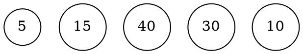
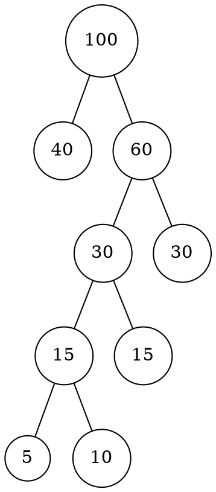

**<font color=darkblue>哈夫曼树不唯一</font>**

##### 哈夫曼编码 Huffman Code
对于待处理的一个字符串序列，若对每个字符用同样长度的二进制位表示，则称这种编码方式为**固定长度编码**。若允许对不同字符用不等长的二进制位表示，则这种方式成为**可变长度编码**。可变长度编码可以对频率高的字符赋予短编码，节省空间，但可能有一个编码是另一个编码的前缀，产生二义性。

若没有一个编码是另一个编码的前缀，则称这样的编码为**前缀编码**。

可以利用哈夫曼树得到前缀编码，称为**哈弗曼编码**。将每个出现的字符当作一个独立的结点，其权值为它出现的频度（或次数），构造出对应的哈夫曼树。所有字符结点都出现在叶子结点中。可将字符的编码解释为从根到该字符的路径上边标记的序列，其中边标记为0表示“转向左孩子”，边标记为1表示“转向右孩子”

左右结点的顺序是任意的，构造出的哈夫曼树并不唯一，但各哈夫曼树的带权路径长度相同且为最优
