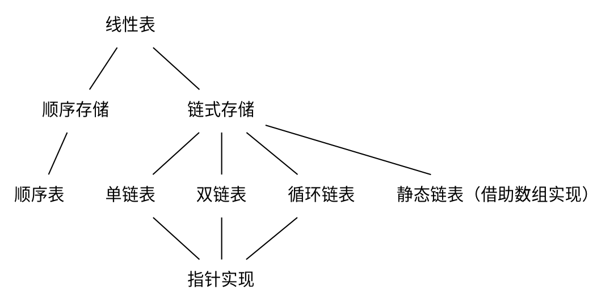

## 第一章 绪论
数据元素    数据对象

### 逻辑结构
* **线性结构**
* **集合结构**
* **树形结构**
* **图形结构**

### 物理结构（存储结构）
* 数组（顺序存储结构）
* 链表（链式存储结构）

### ADT-abstract data type 抽象数据类型
#### 定义
一个数学模型以及定义在该模型上的一组操作
#### 一般描述形式
```
ADT 抽象数据类型名称 {
    数据对象：
    ……
    数据关系：
    ……
    操作集合：
    操作名1：
    ……
    ……
    操作名n：
}
```
#### 例子 
ADT 自然数
* Objects: 从0到无穷大的整数
* Functions: + - * / =
#### 关键
使用它的人可以只关心它的逻辑特征，不需要了解它的存储方式。定义它的人同样不必要关心它如何存储。
#### ADT的两个步骤
1. 实现ADT（封装）
2. 使用ADT

实现和使用隔离

### 算法
#### 算法满足
* 输入
* 输出
* 确定性
* 有穷性
* 有效性

#### 衡量算法的标准
* Correctness 正确性
* Readability 可读性
* Robustness 健壮性
* Usability 可用性
* Simplicity 简洁性
* **Efficiency 效率**（核心的）

#### 衡量效率的指标
* 时间
* 内存空间

#### 时间复杂度
##### 大O表示法
一个语句的频度是指该语句在算法中被重复执行的次数。算法中所有语句的频度之和记为**T(n)**，它是该算法问题规模n的函数，时间复杂度主要分析T(n)的数量级。算法中基本运算（*最深层循环内*的语句）的频度与T(n)同数量级，因此通常采用算法中基本运算的频度f(n)来分析算法的时间复杂度。因此，算法的时间复杂度记为
```tex
T(n)=O(f(n))
```
O的含义是T(n)的数量级，其严格的数学定义是：若T(n)和f(n)是定义在正整数集合上的两个函数，则存在正常数C和n0，使得当n!=n0时，都满足0<=T(n)<=Cf(n).图示如下：


可以总结为: 
**<font color=darkblue>T(n)增长率小于等于f(n)</font>**

##### 除此之外的表示法
* 
```tex
T(n)=\Omega(g(n))
```

T(n)增长率大于等于g(n)
* 
```tex
T(n)=\Theta(b(n))
```

T(n)增长率等于b(n)
* 
```tex
T(n)=o(p(n))
```

T(n)增长率小于p(n)

---

* **最坏时间复杂度**是指在最坏情况下，算法的时间复杂度
* **平均时间复杂度**是指所有可能输入实例在等概率出现的情况下，算法的期望运行时间
* **最好时间复杂度**是指在最好情况下，算法的时间复杂度

一般总是考虑最坏时间复杂度，以保证算法的运行时间不会比它更长

##### 加法规则
```tex
T(n)=T_1(n)+T_2(n)=O(f(n))+O(g(n))=O(max(f(n),g(n)))
```
##### 乘法规则
```tex
T(n)=T_1(n)\times T_2(n)=O(f(n))\times O(g(n))=O(f(n)\times g(n))
```

##### 常见的时间复杂度
```tex
O(1)<O(\log_2 n)<O(n)<O(n\log_2 n)<O(n^2)<O(n^3)<O(2^n)<O(n!)<O(n^n)
```

##### T(n)写法
1. 忽略常数
不能写
```tex
O(2n^2)
```
，得写成
```tex
O(n^2)
```
2. 忽略低次项
不能写
```tex
O(n^2+n)
```
，得写成
```tex
O(n^2)
```
#### 空间复杂度
算法的空间复杂度S(n)定义为该算法所耗费的存储空间，它是问题规模n的函数。记为
```tex
S(n)=O(g(n))
```
## 第二章 线性表


### 定义和基本操作
#### 定义
**线性表**是具有**相同**数据类型的n个数据元素的**有限**序列，其中n为表长，当n=0时该线性表是一个空表。若用L命名线性表，则其一般表示为
```tex
L=(a_1,a_2,...,a_i,a_{i+1},...,a_n)
```

#### 特点
* 表中元素个数有限
* 表中元素具有逻辑上的顺序性，在序列中各元素排序有其先后次序
* 表中元素都是数据元素，每个元素都是单个元素
* 表中元素的数据类型都相同，这意味着每个元素占有相同大小的存储空间
* 表中元素具有抽象性，即仅讨论元素间的逻辑关系，而不考虑元素究竟表示什么内容

**注意：线性表是一种逻辑结构，表示元素之间一对一的相邻关系。顺序表和链表是指存储结构，两种属于不同层面的概念，因此不要将其混淆**

#### 基本操作
* InitList(&L): 初始化表。构造一个空的线性表
* Length(L): 求表长。返回线性表的长度
* LocateElem(L,e): 按值查找操作。在表中查找具有给定关键字值的元素
* GetElem(L,i): 按位查找操作。获取表中的第i个位置的元素的值
* ListInsert(&L,i,e): 插入操作。在表中的第i个位置上插入指定元素e
* ListDelete(&L,i,&e): 删除操作。删除表中第i个位置的元素，并用e返回删除元素的值
* PrintList(L): 输出操作。按前后顺序输出线性表的所有元素值
* Empty(L): 判空操作。若L为空表，则返回true，否则返回false
* DestroyList(&L): 销毁操作。销毁线性表，并释放线性表L所占用的内存空间

### 线性表的顺序表示
#### 顺序表的定义
线性表的顺序存储又称**顺序表**。它是用一组地址连续的存储单元依次存储线性表中的数据元素，从而使得逻辑上相邻的两个元素在物理位置上也相邻。第一个元素存储在线性表的起始位置，第i个元素的存储位置后面紧接着存储的是第i+1个元素。

假定线性表的元素类型为ElemType，则线性表的顺序存储类型描述为
```c
#define MaxSize 50  //定义线性表的最大长度
typedef struct {
    ElemType data[MaxSize]; //顺序表的元素
    int length; //顺序表的当前长度
}SqList;    //顺序表的类型定义
```

##### 特点
* 表中元素的逻辑顺序与其物理顺序相同
* **随机访问**，即通过首地址和元素序号可在时间O(1)内找到指定的元素
* 存储密度高，每个节点只存储数据元素
* 插入和删除操作需要移动大量元素

#### 基本操作的实现
1. **插入操作**
在顺序表L的第i个位置插入新元素e。若i的输入不合法，则返回false，表示插入失败；否则，将顺序表的第i个元素及其后的所有元素右移一个位置，腾出一个空位置插入新元素e，顺序表长度增加1，插入成功，返回true
```c
bool ListInsert(SqList &L,int i,ElemType e) {
    if(i<1||i>L.length+1)   //判断i的范围是否有效
        return false;
    if(L.length>=MaxSize)   //当前存储空间已满，不能插入
        return false;
    for(int j=L.length;j>=i;j--)    //将第i个元素及之后的元素后移
        L.data[j]=L.data[j-1];
    L.data[i-1]=e;  //在位置i处放入e
    L.length++;    //线性表长度加1
    return true;
}
```

最好情况：在表尾插入（即i=n+1），元素后移语句将不执行，时间复杂度为O(1)
最坏情况：在表头插入（即i=1），元素后移语句将执行n次，时间复杂度为O(n)
平均情况：n/2次

因此线性表插入算法的平均时间复杂度为O(n)

2. **删除操作**
删除顺序表L中第i个位置的元素，若成功则返回true，并将被删除的元素用引用变量e返回，否则返回false
```c
bool ListDelete(SqList &L,int i,Elemtype &e) {
    if(i<1||i>L.length) //判断i的范围是否有效
        return false;
    e=L.data[i-1];  //将被删除的元素赋值给e
    for(int j=i;j<L.length;j++) //将第i个位置后的元素前移
        L.data[j-1]=L.data[j];
    L.length--; //线性表长度减1
    return true;
}
```
最好情况：删除表尾元素（i=n），无须移动元素，时间复杂度为O(1)
最坏情况：删除表头元素（i=1），需要移动除第一个元素外的所有元素，时间复杂度为O(n)
平均情况：(n-1)/2次

因此线性表删除算法的平均时间复杂度为O(n)

3. **按值查找**
在顺序表L中查找第一个元素值等于e的元素，并返回其位序
```c
int LocateElem(SqList L,ElemType e) {
    int i;
    for(i=0;i<L.length;i++)
        if(L.data[i]==e)
            return i+1; //下标为i的元素值等于e，返回其位序i+1
    return 0;   //退出循环，说明查找失败
}
```
最好情况：查找的元素就在表头，仅需比较一次，时间复杂度为O(1)
最坏情况：查找的元素在表尾（或不存在时），需要比较n次，时间复杂度为O(n)
平均情况：假设pi是查找的元素在第i个位置上的概率，则平均次数为
```tex
\sum^n_{i=1}p_i\times i=\sum^n_{i=1}\frac{1}{n}\times i=\frac{1}{n}\frac{n(n+1)}{2}=\frac{n+1}{2}  
```
次  
因此线性表查找算法的平均时间复杂度为O(n)

### 线性表的链式表示
#### 单链表的定义
线性表的链式存储又称**单链表**，它是指通过一组任意的存储单元来存储线性表中的数据元素。为了建立数据元素之间的线性关系，对每个链表节点，除存放元素自身的信息外，还需要存放一个指向其后继的指针。

单链表中结点类型的描述如下：
```c
typedef struct LNode {  //定义单链表节点类型
    ElemType data;  //数据域
    struct LNode *next; //指针域
} LNode,*LinkList;
```

* 优点：不需要大量连续存储空间
* 缺点：附加指针域浪费存储空间

**特点**：非随机存取的存储结构，即查找某个特定的节点时，需要从表头开始遍历，依次查找

通常用头指针来表示一个单链表，如单链表L，头指针为NULL时表示一个空表。此外，为了操作上的方便，在单链表第一个节点之前附加一个节点，称为**头结点**。头结点的数据域可以不设任何信息，也可以记录表长等相关信息。头结点的指针域指向线性表的第一个元素节点，如图所示：


头结点和头指针的区分：不管带不带头结点，头指针始终指向链表的第一个节点，而头结点是带头结点的链表中的第一个节点，节点内通常不存储信息

引入头结点后，可以带来两个优点：
1. 由于开始节点的位置被存放在头结点的指针域中，所以在链表的第一个位置上的操作和在表的其他位置上的操作一直，无须进行特殊处理
2. 无论链表是否为空，其头指针都是指向头结点的非空指针（空表中头结点的指针域为空），因此空表和非空表的处理也就得到了统一

#### 单链表上基本操作的实现
1. **采用头插法建立单链表**
每次将读入的新节点插入链表的表头，即头结点之后
```c
LinkList List_HeadInsert(LinkList &L) {
    LNode *s;int x;
    L=(LinkList)malloc(sizeof(LNode));  //创建头结点
    L->next=NULL;   //初始为空链表
    scanf("%d",&x); //输入节点的值
    while(x!=9999) {    //输入9999表示结束
        s=(LNode*)malloc(sizeof(LNode));    //创建新节点
        s->data=x;
        s->next=L->next;
        L->next=s;  //将新节点插入表中，L为头指针
        scanf("%d",&x);
    }
    return L;
}
```
采用头插法建立单链表时，读入数据的顺序与生成的链表中的元素的顺序是相反的。每个节点插入的时间为O(1)，设单链表长为n，则总时间复杂度为O(n)